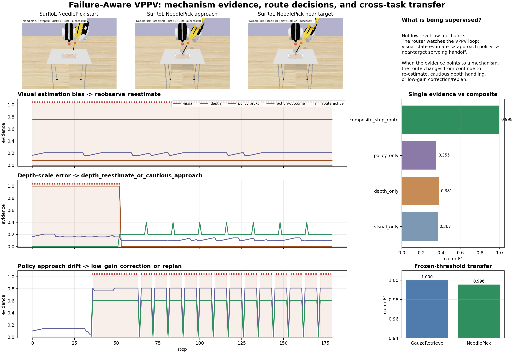
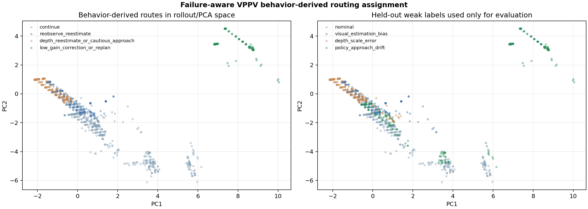
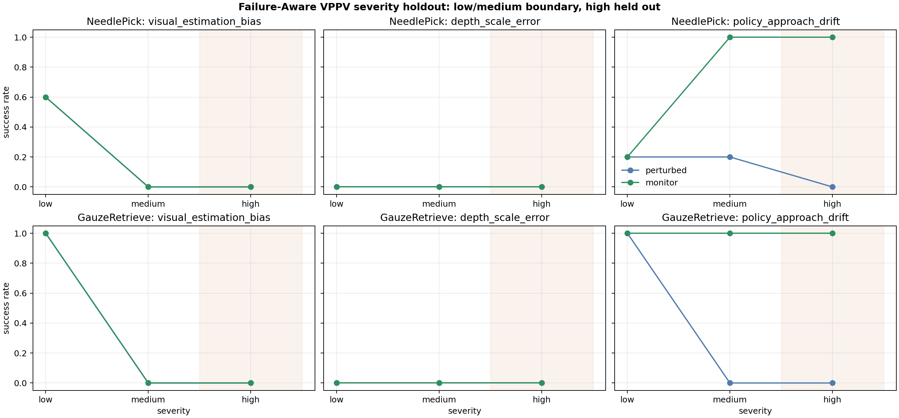
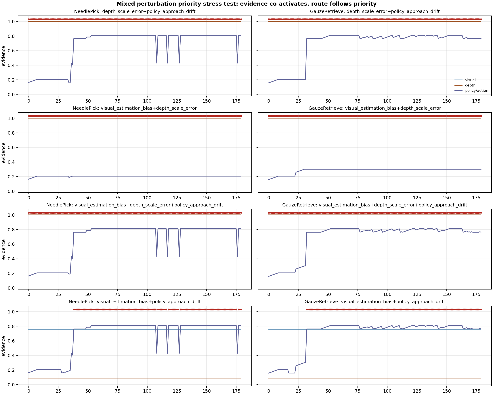
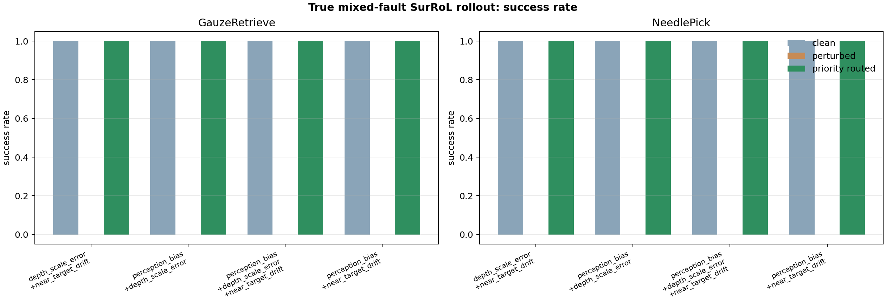
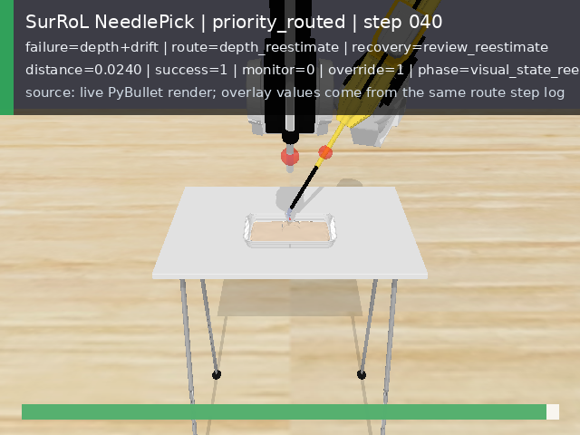

# Mechanism-Aware Reliability Routing for Surgical Robot Learning

Simulator evidence for diagnosing target-estimation, approach-policy, and
near-target handoff failures.

This repository studies a reliability problem in surgical robot learning:

> A surgical robot-learning pipeline may estimate a visual target, move toward
> it with a learned or high-level policy, and then rely on local servoing or
> controller execution. The missing question is whether the system can detect
> why it is becoming unreliable and choose the right response before unsafe
> continuation becomes the default.

The project is a research prototype. It is not a deployed surgical robot safety
system, does not claim hardware or clinical validation, and must not be read as
evidence for autonomous surgical deployment.

## Suggested Reading

This repository preserves a long research trail, including proxy RL, SurRoL
migration, weak-label mechanism analysis, and routed recovery. For a fast
review, start here:

1. [Framework document](docs/RELIABILITY_SUPERVISED_VPPV_FRAMEWORK.md): the clean final spine, including the three mechanisms, weak-label rollout data, policy-side separability, composite routing, and metrics.
2. [Final supervisor brief](reports/failure_aware_vppv_final_teacher_brief.md): the shortest evidence ladder and the safest current claim.
3. [Project index](docs/PROJECT_INDEX.md): a map from each claim to the detailed reports, figures, tables, and rebuild commands.

Current status: the simulator evidence package is complete enough to describe
the project as **mechanism-aware reliability routing for surgical robot
learning**, with a VPPV-style perception-policy-servoing loop used as one
motivating case study rather than the only intended audience.

## What This Adds

The project adds an ECG-inspired reliability supervisor around surgical
simulation rollouts: it separates visual target-estimation bias, policy
approach drift, and near-target occlusion or servo failure, then routes each
mechanism to a different response instead of applying one generic retry rule.

```text
observed rollout behavior
  -> mechanism evidence
  -> failure-source detection
  -> route-specific response
  -> re-observe, re-estimate, low-gain correction, pause/review, or abort
```

## How To Read The Evidence

The project uses controlled perturbations to create weak mechanism labels, so
the evidence must be handled carefully. The README and reports separate
mechanism discovery, route assignment, and outcome validation:

- Mechanism labels come from known simulator perturbations; they are not
  surgeon annotations and not hidden labels from an upstream private policy.
- Route assignment is not validated only by reading the injected label back.
  The project also checks step-level evidence, single-signal ablation,
  cross-task transfer, severity holdout, mixed-priority behavior,
  behavior-derived clustering, early warning, false alarms, and true mixed
  SurRoL/PyBullet rollouts.
- Behavior-derived routing holds mechanism labels out during clustering. Labels
  are used afterward to evaluate whether discovered rollout regions align with
  expected routes.
- The claim is not full hidden-layer discovery inside a private or unavailable
  upstream model. The claim is simulator-side mechanism evidence,
  policy/trajectory separability, and route-specific recovery validation.
- Recovery success is reported together with evidence boundaries. The strongest
  current result is still smoke-scale scripted-oracle simulation, not a learned
  surgical-policy deployment.

## How The Work Developed

The work should be read as a sequence of controlled hypotheses, not as a pile
of recovery demos:

```text
1. CircleRL / constrained proxy
   -> isolate biased target estimates, unsafe continuation, and monitor recovery

2. Risk-gated and mechanism-routed proxy control
   -> show that runtime supervision can be selective rather than always-on

3. SurRoL/PyBullet migration
   -> move the same reliability idea into rendered surgical simulation tasks

4. Perception-policy reframing
   -> focus on target estimation, approach movement, and near-target handoff
      instead of low-level jaw or gripper mechanics

5. Weak-label mechanism dataset
   -> generate normal, visual-bias, policy-drift, and near-target failure traces

6. Policy-side / behavior-derived analysis
   -> test whether rollout evidence separates mechanisms before route assignment

7. Composite mechanism router
   -> route visual, policy, and near-target failures to different interventions

8. Multi-angle route validation
   -> ablation, cross-task transfer, severity holdout, mixed-priority audit,
      behavior-derived clustering, early warning, and true mixed rollouts
```

The main contribution is therefore the **mechanism evidence to routing chain**:

```text
observed surgical rollout failure
  -> measured visual / policy / near-target evidence
  -> mechanism-specific route
  -> outcome and safety-boundary validation
```

CircleRL is the first controlled sandbox in that chain. It demonstrates the
problem in a small environment where the target estimate can be biased, the
tool can drift toward the wrong region, and a monitor can trigger re-estimation
or recovery. The final repository claim, however, is broader than the CircleRL
video: it is about mechanism-aware reliability routing for surgical
robot-learning simulation.

## Problem Setting

The project is not mainly about learning every surgical motion primitive. In
SurRoL-style simulation, task dynamics and controller primitives already exist
for many movements. The reliability problem is different:

- a visual estimate can point the policy toward the wrong target;
- an approach policy can drift into the wrong near-target region;
- near the target, visual evidence or servoing can become unreliable;
- recovery itself may become unsafe if the system continues blindly.

The research question is:

> Can a surgical robot-learning pipeline know when it is unreliable,
> why it is unreliable, and which response is appropriate before unsafe
> continuation becomes the default?

The final claim is not "we trained a better gripper." The final claim is:

> We build and evaluate a mechanism-aware reliability router that separates
> visual estimation bias, policy approach drift, and near-target
> occlusion/servo failure, then maps them to different interventions.

## Failure Mechanisms

The current framework intentionally keeps three main mechanisms. Older
jaw-stuck, object-drop, and generic grasp-retry tests remain in the repository
as migration evidence, but they are not the final main contribution.

| Mechanism | What is simulated | Why it matters | Route |
| --- | --- | --- | --- |
| `visual_estimation_bias` | segmentation, depth, or regressor bias shifts the estimated target | the policy may move correctly toward the wrong target estimate | re-observe / re-estimate |
| `policy_approach_drift` | the approach movement enters a wrong near-target region | the policy may look locally plausible while global progress fails | low-gain correction / replan |
| `near_target_occlusion_or_servo_failure` | near the target, visual evidence or servo feedback becomes unreliable | continuing blindly can be unsafe exactly when precision matters most | pause / camera reposition / human review |
| unsafe near-target continuation | recovery or continuation becomes risky | the recovery action itself can be dangerous | abort / human takeover |

Mechanism labels are generated by controlled perturbation:

```text
normal rollout
visual bias rollout
policy drift rollout
near-target occlusion / servo-failure rollout
```

Each trajectory records state transitions, distance/progress, estimated and
observed target evidence, action behavior, outcome, and expected route.

## Borrowing The ECG Logic

The ECG project matters here because it does not stop at an embedding plot. It
uses model/data evidence to identify error mechanisms, then maps those
mechanisms to training constraints or recover routes. This project transfers
that style into robot rollouts, with one important boundary: the upstream
reference checkpoint, training data, hidden activations, and confidence outputs
are not available.

So the current implementation uses behavior-derived rollout evidence:

| Analysis family | Surgical rollout version | Question |
| --- | --- | --- |
| representation geometry | PCA, behavior embedding, cluster fingerprints | do mechanisms occupy different behavior regions? |
| visual uncertainty | visual residual, target bias, depth-scale proxy | does visual-state evidence rise before failure? |
| action-outcome mismatch | command versus realized progress | did movement drift away from the intended approach? |
| KNN / prototype conflict | local-neighborhood instability and route conflict | is this rollout atypical for nominal execution? |
| composite risk score | early warning score | can the system warn before terminal failure? |

This is the closest available analogue to ECG-style model-derived evidence in
the absence of a private upstream model audit.

## Policy-Side Separability

One core test asks whether simulator rollout evidence separates mechanisms
before route assignment:

```text
SurRoL step traces from a VPPV-style case study
  -> policy-proxy evidence and rollout behavior features
  -> PCA / behavior embedding
  -> KNN, prototype, and local-neighborhood conflict evidence
  -> train-cluster fingerprints
  -> mechanism route assignment
  -> held-out episode evaluation
```

Mechanism labels are not used to form the clusters. They are used afterward to
evaluate whether the discovered behavior regions align with expected routes.

| Held-out quantity | Result |
| --- | ---: |
| step rows | 3,351 |
| episodes | 26 |
| route assignment accuracy | 0.996 |
| macro-F1 | 0.995 |
| missed high-risk step rate | 0.000 |
| nominal false alarm rate | 0.025 |

Evidence:

- [Behavior-derived routing report](reports/failure_aware_vppv_model_derived_routing.md)
- [Behavior-derived PCA figure](reports/figures/failure_aware_vppv/failure_aware_vppv_model_derived_pca.png)
- [Cluster fingerprint table](reports/tables/failure_aware_vppv_model_derived_clusters.csv)

## Routing Rules

The router is not a uniform retry rule. Different mechanisms imply different
interventions:

| Detected evidence | Route |
| --- | --- |
| visual target-estimation bias | re-observe / re-estimate |
| policy approach drift | low-gain corrective movement / replan |
| near-target occlusion or servo failure | pause / camera reposition / human review |
| unsafe near-target continuation | abort / human takeover |
| nominal evidence | continue |

Priority logic:

```text
runtime evidence
  -> unsafe near-target?
       -> abort / human takeover
  -> near-target occlusion or servo failure?
       -> pause / camera reposition / human review
  -> visual estimation bias?
       -> re-observe / re-estimate
  -> policy approach drift?
       -> low-gain correction / replan
  -> otherwise
       -> continue
```

This route design is the surgical-RL counterpart of the ECG recover logic:
analysis identifies the failure source, and the response is matched to that
source.

## Current Evidence

The project is evaluated with reliability metrics, not only success rate:

| Metric | Why it matters |
| --- | --- |
| mechanism classification accuracy / macro-F1 | whether the system identifies why it is unreliable |
| high-risk failure capture at fixed intervention budget | whether limited review or recovery budget catches important failures |
| residual unsafe failure rate | how much risky failure remains after routing |
| route-specific recovery success | whether the selected response works for the detected mechanism |
| early warning lead time | whether risk is detected before final failure |
| false alarm rate on normal rollouts | whether nominal behavior is interrupted too often |

Current headline evidence:

| Evidence stage | Result | Interpretation |
| --- | --- | --- |
| step-level composite evidence | 10,823 rows; macro-F1 0.998; missed high-risk 0.000 | multi-signal evidence preserves mechanism identity |
| single-evidence ablation | visual 0.367, depth 0.381, policy 0.355, single-score 0.131 macro-F1 | one signal is not enough |
| cross-task frozen thresholds | 1.000 and 0.996 macro-F1 | route thresholds transfer across two SurRoL tasks |
| severity holdout | boundary router 1.000 macro-F1; uniform retry 0.167 | mechanism boundaries survive stronger held-out perturbations |
| mixed-priority audit | priority 1.000; max-signal 0.033; uniform retry 0.000 macro-F1 | co-active evidence needs priority routing |
| behavior-derived routing | macro-F1 0.995; missed high-risk 0.000; false alarm 0.025 | routes can be derived from rollout behavior regions |
| true mixed SurRoL rollouts | clean 40/40, perturbed 0/40, priority-routed 40/40 | route-specific recovery restores success in a smoke-scale PyBullet run |

In the 5-seed true mixed-fault SurRoL smoke run:

| Controller | What it means | Success | Mean final distance |
| --- | --- | ---: | ---: |
| clean | no injected mixed fault | 40/40 | 0.015 |
| perturbed | mixed visual/depth/near-target faults, no route response | 0/40 | 0.224 |
| priority-routed | same mixed faults plus mechanism-priority routing | 40/40 | 0.016 |

This is the strongest current simulation result, but it remains scripted-oracle
PyBullet evidence rather than learned-policy or hardware validation.

## Evidence Map

| Claim | Evidence | Source |
| --- | --- | --- |
| The project is about reliability supervision, not low-level gripper learning. | Final problem definition, three-mechanism framework, and historical-experiment boundary. | [Framework](docs/RELIABILITY_SUPERVISED_VPPV_FRAMEWORK.md) |
| CircleRL/proxy work identifies the failure mechanism in a controlled setting. | Biased target recovery media and trace evidence. | [CircleRL MP4](reports/media/circlerl_recovery_demo/circlerl_bias_recovery.mp4), [CircleRL trace](reports/media/circlerl_recovery_demo/circlerl_bias_recovery_trace.csv) |
| Mechanisms are visible in rollout evidence. | Step-level composite evidence over 10,823 weak-labeled rows. | [Step evidence report](reports/failure_aware_vppv_step_evidence.md) |
| A single evidence family is insufficient. | Single-evidence ablation underperforms the composite router. | [Step evidence report](reports/failure_aware_vppv_step_evidence.md) |
| Mechanism routing transfers across tasks. | Frozen thresholds transfer between NeedlePick and GauzeRetrieve. | [Cross-task report](reports/failure_aware_vppv_cross_task_generalization.md) |
| Mechanism boundaries survive severity shift. | Low/medium calibration tested on held-out high severity. | [Severity holdout report](reports/failure_aware_vppv_severity_holdout.md) |
| Co-active failures need priority routing. | Priority router beats max-signal and uniform retry in mixed-priority audit. | [Mixed-priority report](reports/failure_aware_vppv_mixed_perturbation_priority.md) |
| Routes can be derived from policy/trajectory evidence. | Behavior-derived clustering and held-out route assignment reach macro-F1 0.995. | [Behavior-derived routing report](reports/failure_aware_vppv_model_derived_routing.md) |
| Route-specific recovery helps inside SurRoL dynamics. | True mixed rollouts: perturbed 0/40, priority-routed 40/40. | [True mixed rollout report](reports/failure_aware_vppv_true_mixed_rollouts.md) |
| The final claim is bounded. | Final brief and evidence matrix separate current evidence from deployment claims. | [Final supervisor brief](reports/failure_aware_vppv_final_teacher_brief.md), [Evidence matrix](reports/tables/failure_aware_vppv_final_evidence_matrix.csv) |

## Media And Visual Checks

| Question | Evidence | Boundary |
| --- | --- | --- |
| What does the CircleRL proxy recovery look like? | [CircleRL recovery MP4](reports/media/circlerl_recovery_demo/circlerl_bias_recovery.mp4), [GIF](reports/media/circlerl_recovery_demo/circlerl_bias_recovery.gif) | proxy visualization, not final SurRoL evidence |
| What is the final reliability story? |  | SurRoL frames plus evidence curves and routes |
| Do behavior regions separate routes? |  | rollout-behavior representation, not unavailable upstream hidden layers |
| Do mechanisms survive severity shift? |  | low/medium calibration, high severity held out |
| What if evidence co-activates? |  | compositional priority audit |
| Do mixed faults execute in SurRoL dynamics? |  | scripted-oracle PyBullet smoke run |
| Does the recovery route visibly restore a failed mixed-fault rollout? | [Slowed routed recovery video](reports/media/failure_aware_vppv_true_mixed_recovery/surrol_true_mixed_priority_routed_recovery_slow.mp4), [perturbed-vs-routed comparison](reports/media/failure_aware_vppv_true_mixed_recovery/surrol_true_mixed_perturbed_vs_routed_slow.mp4),  | functional SurRoL/PyBullet recovery evidence; base controller is the scripted oracle, not a VPPV checkpoint |
| Was SurRoL/PyBullet actually rendered? | [NeedleReach GIF](reports/media/surrol_render_evidence/needlereach/needlereach_oracle_rollout.gif), [NeedlePick GIF](reports/media/surrol_render_evidence/needlepick/needlepick_oracle_rollout.gif), [GauzeRetrieve GIF](reports/media/surrol_render_evidence/gauzeretrieve/gauzeretrieve_oracle_rollout.gif) | visual migration evidence |

## Earlier Work Kept For Context

These components remain in the repository because they explain how the final
research question developed:

| Earlier component | Current role |
| --- | --- |
| CircleRL / constrained proxy | problem-definition sandbox for biased targets, safety gating, and recovery |
| tangent backup and risk-gated tangent | controller-level evidence that runtime supervision can reduce unnecessary intervention |
| jaw-stuck / object-drop / grasp recovery | historical SurRoL migration stress tests, not the final reliability-supervision contribution |
| embedding-risk PPO retraining | preliminary test that analysis signals can influence learning, but not the final claim |
| generic recovery videos | supporting visual evidence only |

The final story is narrower:

```text
not "robot learns every surgical action"
not "all failures get retried"
not "jaw mechanics are the main contribution"

yes "the system detects when it is unreliable"
yes "the system explains which mechanism is failing"
yes "the route depends on the mechanism"
```

## Scope

- This is simulator research, not clinical validation.
- This is not real-robot deployment.
- This is not a complete end-to-end learned surgical autonomy system.
- Route labels are weak labels from controlled simulator perturbations.
- Behavior-derived analysis is not hidden-layer analysis of an upstream private
  surgical policy model.
- The true mixed rollout uses scripted-oracle PyBullet recovery logic.
- Several results are strong as internal consistency or smoke-scale evidence,
  but they are not external validation.

## Files

```text
src/                         custom constrained surgical RL environments
scripts/                     experiment, analysis, plotting, and report scripts
tests/                       unit and regression tests
docs/                        method docs and project framing
reports/                     detailed reports, figures, media, and tables
reports/figures/             reliability evidence figures
reports/media/               rendered SurRoL and CircleRL visual evidence
reports/tables/              machine-readable summaries
outputs/                     selected lightweight aggregate summaries
runs/                        local checkpoints and training outputs, not committed
```

## Run The Main Checks

```powershell
# Lightweight regression tests
python -m pytest -q

# Behavior-derived route assignment
python scripts\build_failure_aware_vppv_model_derived_routing.py

# Final evidence package
python scripts\build_failure_aware_vppv_final_package.py

# Step-level mechanism evidence
python scripts\build_failure_aware_vppv_step_evidence.py

# Cross-task, severity, and mixed-priority checks
python scripts\evaluate_failure_aware_vppv_cross_task.py
python scripts\evaluate_failure_aware_vppv_severity_holdout.py
python scripts\evaluate_failure_aware_vppv_mixed_priority.py
```
