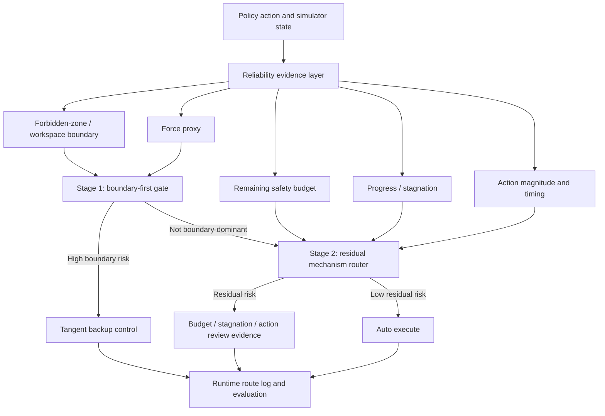
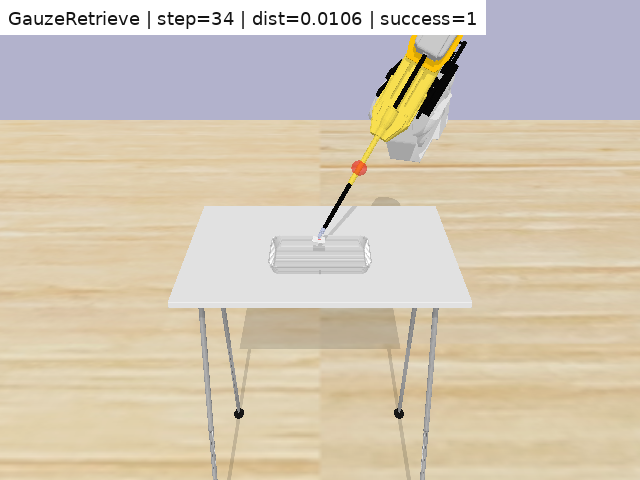
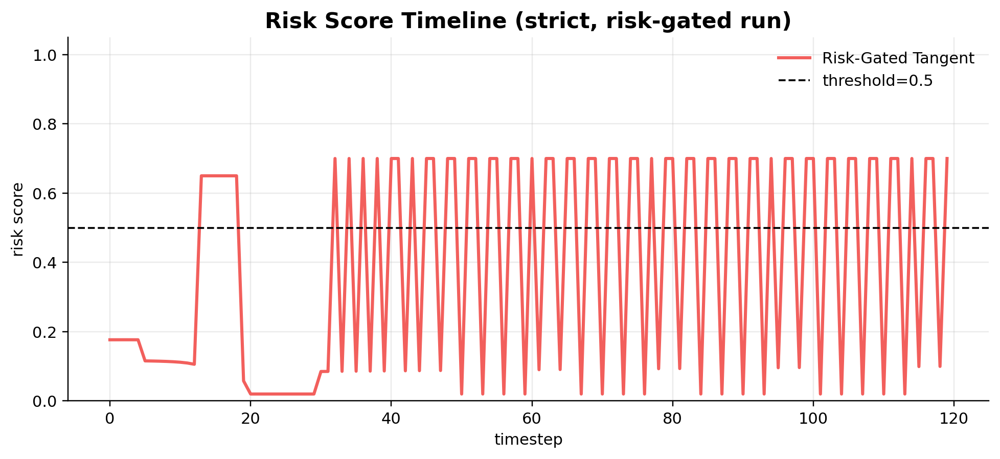
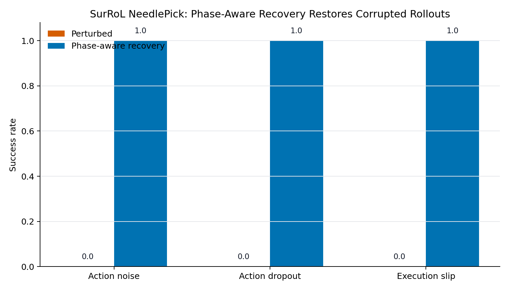
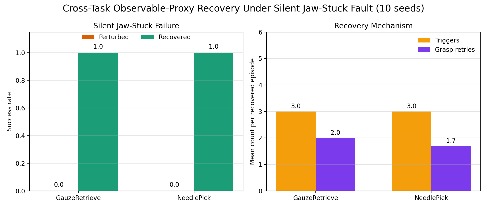
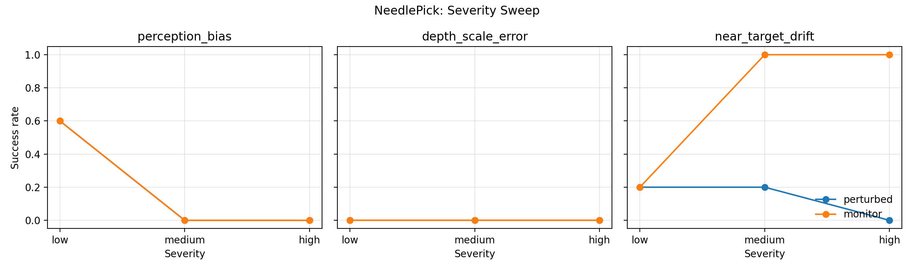
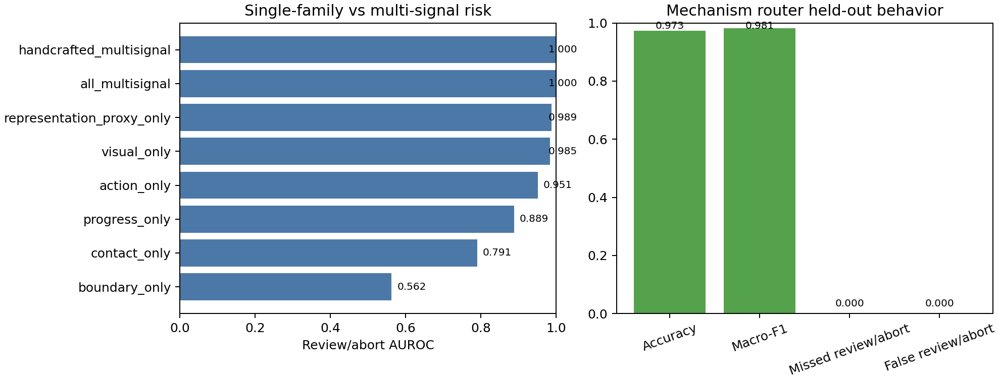

# Failure-Aware Surgical RL Under Runtime Uncertainty

Research code and public evidence for studying whether simulated surgical
robot policies can recognize unreliable execution and route intervention
before unsafe recovery or safety-budget failure becomes irreversible.

The central question is not only whether a rollout can be recovered. The main
question is whether the robot can identify **when** execution is becoming
unreliable, **what mechanism** caused the risk, and whether it should continue,
recover automatically, request review, or stop.

> Research prototype only. This repository is not a deployed surgical robot
> safety system and does not claim clinical, hardware, or real-robot validation.

## Teacher Quick Read

This repository should be read as a reliability-supervision project around a
surgical RL/VPPV pipeline, not as a project that tries to relearn every
low-level surgical motion.

The practical bottleneck is narrow and concrete: the learned policy or VPPV
module can move the tool toward a target, but under visual-state bias,
depth-scale error, approach drift, or near-target handoff error, the tool may
move toward the wrong target estimate or continue when the state is unreliable.
The contribution here is a mechanism-aware runtime layer that detects the
failure source and routes the episode to the right response.

The current project story is:

```text
self-built proxy simulator
  -> define the reliability problem in a small controllable RL setting
  -> build risk-gated and mechanism-routed recovery logic
  -> migrate the same idea into SurRoL/PyBullet tasks
  -> translate the ECG project's reliability analysis style into robot rollouts
  -> focus the final SurRoL/VPPV claim on visual-state and approach-policy reliability
  -> derive routes from model/rollout behavior regions rather than only hand-written rules
  -> test composite routing under step, cross-task, severity, mixed-priority,
     model-derived, and true mixed-fault evidence
```

The final 5-seed true mixed-fault SurRoL smoke test is:

| Controller | What it means | Success | Mean final distance |
| --- | --- | ---: | ---: |
| clean | no injected mixed fault | 40/40 | 0.015 |
| perturbed | mixed visual/depth/near-target faults, no route response | 0/40 | 0.224 |
| priority-routed | same mixed faults plus mechanism-priority recovery | 40/40 | 0.016 |

The most important limitation is also explicit: these are simulator-derived
weak labels and scripted-oracle PyBullet rollouts. They support a research
prototype for mechanism-specific reliability routing, not real surgical
autonomy.

The newest analysis closes the gap with the ECG project's logic more directly:
it embeds model/rollout behavior, clusters the resulting behavior regions, and
assigns routes from cluster evidence fingerprints. Mechanism labels are held
back for evaluation. On held-out episode splits, this model-derived route
assignment reaches macro-F1 0.995 with 0.000 missed high-risk step rate.

For the full teacher-facing experiment process, read
[docs/TEACHER_EXPERIMENT_PROCESS.md](docs/TEACHER_EXPERIMENT_PROCESS.md).
For the final evidence ladder, read
[reports/failure_aware_vppv_final_teacher_brief.md](reports/failure_aware_vppv_final_teacher_brief.md)
and the machine-readable evidence matrix
[reports/tables/failure_aware_vppv_final_evidence_matrix.csv](reports/tables/failure_aware_vppv_final_evidence_matrix.csv).

## Project In One Sentence

This project starts from a simple constrained surgical-tool RL proxy, migrates
the reliability-supervision idea into SurRoL/PyBullet surgical simulation, then
upgrades the runtime supervisor from always-on backup control into risk-gated
and mechanism-separated reliability routing with explicit recovery/review
decisions.

The final GitHub framing is:

- **Risk-gated tangent** is the core controller-level safety result.
- **Mechanism-routed tangent** is the ECG-inspired reliability-routing upgrade.
- **SurRoL recovery routing** is the surgical-simulation migration evidence.
- **Embedding-risk PPO** is a preliminary training-loop experiment, not the
  main success claim.
- **Learning-to-routing flow** explains why the project first tries to improve
  the policy and then moves to runtime supervision when retraining is not
  robust enough.
- **ECG-style RL reliability suite** expands the analysis beyond embedding:
  representation geometry, uncertainty, trajectory structure, perturbation
  robustness, multi-signal risk-head training, and mechanism routing.
- **Failure-aware VPPV routing** reframes the SurRoL work around the actual
  VPPV bottleneck: visual-state estimation, high-level approach policy,
  near-target servoing handoff, and unsafe continuation, not gripper mechanics.
- **Model-derived routing assignment** adds the ECG-like loop from model/rollout
  behavior representation to route assignment, instead of relying only on a
  hand-written mechanism table.
- **Final VPPV evidence package** condenses the step, cross-task, severity,
  mixed-priority, and true mixed-rollout results into one teacher-facing brief
  and a machine-readable evidence matrix.
- The strongest claim is internal simulation evidence for runtime reliability
  supervision, not real surgical autonomy.

## Data And Label Boundary

This repository does not use a real surgical demonstration dataset or
surgeon-labeled action annotations. The action policy is learned inside
simulation.

The experimental sequence is:

1. A small constrained proxy environment is first built to study the basic
   idea: a tool moves toward a target while avoiding a forbidden region,
   force/contact proxy, workspace boundary, and safety-budget exhaustion.
2. A PPO policy learns actions from simulator reward in that proxy. The policy
   is not trained from human labels; it learns by interacting with the
   simulator.
3. The same reliability-supervision idea is then embedded into SurRoL/PyBullet
   surgical simulation tasks. In this stage the project uses simulator
   rollouts, rendered frames, traces, and injected faults, not real patient or
   robot-hardware data.
4. Faults such as action noise, action dropout, execution slip, perception
   bias, depth-scale error, near-target drift, and jaw-stuck behavior are
   injected to expose failure modes that resemble the kinds of degradation
   expected when a policy moves from a clean simulator toward a less reliable
   execution setting.
5. Those perturbed rollouts produce weak reliability labels from the simulator
   logs and routing rules. These labels train a review/abort risk head and a
   four-way mechanism router. They do not train a new surgical action policy
   from expert demonstrations.

So the project separates three things:

| Component | What it learns | Data source |
| --- | --- | --- |
| PPO action policy | continuous simulator actions | simulator reward and rollouts |
| binary risk head | whether execution should enter review/abort | weak labels from perturbed simulation logs |
| mechanism router | continue, recover, review, or abort-candidate | injected-failure family, rollout evidence, and routing rules |

This is why the final claim is a simulation reliability-supervision prototype:
the system studies when a learned policy becomes unreliable under noise,
perception shift, contact uncertainty, or unsafe recovery conditions, then
routes execution into correction, recovery, review, or abort-candidate states.
It does not claim that a real surgical policy has been learned from clinical
data. This framing is also why the project is relevant to sim-to-real
reliability: even a policy that works in a clean simulator may fail under
shifted perception, noisy execution, contact mismatch, or unsafe recovery
conditions.

## CircleRL Proxy Logic: Task, Errors, Explanation, And Routing

The first experiment is a deliberately small proxy, referred to in project
notes as CircleRL and implemented as the custom constrained tool-navigation
environment. It is not a real surgical dataset. It is a controlled simulator
used to make the reliability question concrete before moving the idea into
SurRoL.

### Task Definition

The proxy task asks a tool tip to move from a start region to a target region
while avoiding a forbidden circular/spherical zone. The policy observes tool
position, target position, forbidden-zone position, distance-to-goal,
force/contact proxy, task phase, time, and remaining safety budget. PPO learns
continuous actions from reward:

```text
tool state
  -> PPO action
  -> simulator step
  -> distance reward, success bonus, force/boundary penalties
  -> safety-budget termination if cumulative risk becomes too high
```

The learned policy therefore tries to reach the target, but it can still become
unreliable when the state estimate, action execution, or safety geometry is
perturbed.

### Injected Failure Modes

| Failure mode | What is perturbed | What it represents | Typical symptom |
| --- | --- | --- | --- |
| `target_drift` | the true target moves after execution begins | target shift or changed task condition | policy continues along an outdated path |
| `state_target_bias` | the policy observes a biased target location | perception/state-estimation bias | action is reasonable for the wrong target |
| `state_dropout` | target observation is dropped or zeroed | missing visual/state signal | policy loses task direction |
| `execution_slip` | the executed action is scaled down | actuator slip or action-outcome mismatch | progress stalls despite policy commands |
| forbidden-zone proximity | proposed action moves near the forbidden zone | geometric safety risk | force proxy and violation risk increase |
| safety-budget exhaustion | cumulative risk exceeds the episode budget | unsafe or inefficient execution | episode terminates before reliable completion |

These failures are not class labels supplied by a human annotator. They are
controlled perturbations used to create weak reliability labels from simulator
logs.

### Error Explanation Signals

The project explains proxy failures with interpretable runtime evidence rather
than only with success/failure:

| Evidence signal | Reliability question |
| --- | --- |
| `distance_to_goal` and short-window progress | Is the tool still moving toward the target? |
| `distance_to_forbidden` | Is the current state close to the forbidden zone? |
| `proposed_distance_to_forbidden` | Would the next action move into a risky region? |
| `force_proxy` | Is contact/penetration-like risk increasing? |
| `remaining_budget` | Is safe execution capacity being depleted? |
| `action_norm` | Is the policy asking for unusually large motion? |
| `risk_reasons` | Which mechanism triggered the risk gate? |

This converts a vague failure statement such as "the policy failed" into a
mechanism-level explanation: boundary risk, stalled progress, low safety
budget, state-estimation error, or action-execution mismatch.

### Routing And Recovery Logic

The proxy then tests whether those explanations can control runtime behavior:

```text
policy action
  -> reliability evidence
  -> route decision
  -> execute, tangent backup, monitor recovery, review, or abort-candidate
```

| Route or controller | When it is used | Runtime behavior |
| --- | --- | --- |
| `auto_execute` | no strong risk signal | execute the PPO action |
| tangent backup | action would approach the forbidden zone | replace the action with a tangential motion around the forbidden zone |
| risk-gated tangent | risk score is high enough | activate tangent backup only on high-risk steps |
| mechanism-routed tangent | boundary risk is separated from residual risk | Stage 1 handles forbidden-zone risk; Stage 2 logs budget/stagnation/action-risk evidence |
| monitor recovery | drift/slip/dropout is detected as recoverable | temporarily use a heuristic recovery action to regain progress |
| `human_review` | state or target estimate is unreliable | do not blindly retry; flag review or re-estimation |
| `abort_candidate` | recovery itself may enter an unsafe region or exhaust budget | stop or flag the rollout as unsafe to continue |

The key proxy result is therefore not simply that a controller can recover a
trajectory. The result is that the project can define a small RL task, induce
specific failure mechanisms, explain why the policy becomes unreliable, and
route each case to a different intervention. This is the logic later migrated
to SurRoL recovery, observable supervision, and multi-signal mechanism routing.

## Surgical-Simulation Task Upgrade Framework

CircleRL is intentionally simple. The project therefore upgrades the same
reliability-routing logic into a task-level SurRoL framework. Each task is
treated as a different surgical reliability problem rather than as another
generic obstacle-avoidance run.

For the full framework, see
[docs/SURROL_TASK_UPGRADE_FRAMEWORK.md](docs/SURROL_TASK_UPGRADE_FRAMEWORK.md)
and the machine-readable table
[reports/tables/surgical_task_upgrade_framework.csv](reports/tables/surgical_task_upgrade_framework.csv).
For the ECG-style mechanism-routing translation, see
[docs/SURROL_ECG_STYLE_MECHANISM_ROUTING.md](docs/SURROL_ECG_STYLE_MECHANISM_ROUTING.md)
and the machine-readable map
[reports/tables/surrol_ecg_style_mechanism_map.csv](reports/tables/surrol_ecg_style_mechanism_map.csv).
For the VPPV-specific multi-evidence reframing and composite router, see
[docs/FAILURE_AWARE_VPPV_MULTIEVIDENCE_FRAMEWORK.md](docs/FAILURE_AWARE_VPPV_MULTIEVIDENCE_FRAMEWORK.md),
[reports/failure_aware_vppv_composite_router.md](reports/failure_aware_vppv_composite_router.md),
and
[reports/tables/failure_aware_vppv_route_summary.csv](reports/tables/failure_aware_vppv_route_summary.csv).
The step-level follow-up evidence is in
[reports/failure_aware_vppv_step_evidence.md](reports/failure_aware_vppv_step_evidence.md),
with the step dataset
[reports/tables/failure_aware_vppv_step_dataset.csv](reports/tables/failure_aware_vppv_step_dataset.csv)
and mechanism evidence figure
[reports/figures/failure_aware_vppv/failure_aware_vppv_step_evidence.png](reports/figures/failure_aware_vppv/failure_aware_vppv_step_evidence.png).
The cross-task follow-up freezes thresholds on one SurRoL task and tests them
on the other:
[reports/failure_aware_vppv_cross_task_generalization.md](reports/failure_aware_vppv_cross_task_generalization.md)
and
[reports/tables/failure_aware_vppv_cross_task_summary.csv](reports/tables/failure_aware_vppv_cross_task_summary.csv).
The severity-held-out follow-up calibrates intervention boundaries on low/medium
severity and evaluates held-out high severity:
[reports/failure_aware_vppv_severity_holdout.md](reports/failure_aware_vppv_severity_holdout.md)
and
[reports/figures/failure_aware_vppv/failure_aware_vppv_severity_holdout.png](reports/figures/failure_aware_vppv/failure_aware_vppv_severity_holdout.png).
The mixed-perturbation priority audit combines existing mechanism traces to
test whether co-active evidence is routed by priority rather than by a generic
retry score:
[reports/failure_aware_vppv_mixed_perturbation_priority.md](reports/failure_aware_vppv_mixed_perturbation_priority.md)
and
[reports/figures/failure_aware_vppv/failure_aware_vppv_mixed_priority_evidence.png](reports/figures/failure_aware_vppv/failure_aware_vppv_mixed_priority_evidence.png).
The true mixed-fault SurRoL follow-up executes those combined fault proxies in
PyBullet rollouts:
[reports/failure_aware_vppv_true_mixed_rollouts.md](reports/failure_aware_vppv_true_mixed_rollouts.md)
and
[reports/figures/failure_aware_vppv/failure_aware_vppv_true_mixed_success.png](reports/figures/failure_aware_vppv/failure_aware_vppv_true_mixed_success.png).
The model-derived routing follow-up derives route assignments from behavior
clusters rather than from direct mechanism labels:
[reports/failure_aware_vppv_model_derived_routing.md](reports/failure_aware_vppv_model_derived_routing.md)
and
[reports/figures/failure_aware_vppv/failure_aware_vppv_model_derived_pca.png](reports/figures/failure_aware_vppv/failure_aware_vppv_model_derived_pca.png).
The final packaged evidence is summarized in
[reports/failure_aware_vppv_final_teacher_brief.md](reports/failure_aware_vppv_final_teacher_brief.md),
[reports/tables/failure_aware_vppv_final_evidence_matrix.csv](reports/tables/failure_aware_vppv_final_evidence_matrix.csv),
and the GitHub readiness audit
[reports/failure_aware_vppv_github_readiness_audit.md](reports/failure_aware_vppv_github_readiness_audit.md).
For a one-page supervisor-facing explanation, see
[reports/failure_aware_vppv_supervisor_brief.md](reports/failure_aware_vppv_supervisor_brief.md)
and the summary figure
[reports/figures/failure_aware_vppv/failure_aware_vppv_supervisor_pack.png](reports/figures/failure_aware_vppv/failure_aware_vppv_supervisor_pack.png).

| Task | Failure mechanism being tested | Route decision | Recovery / response |
| --- | --- | --- | --- |
| NeedleReach | final localization or near-target approach drift | `auto_recovery` or `human_review` | short-window correction or state re-estimation |
| NeedlePick | needle grasp, perception bias, jaw-stuck, unsafe near-target recovery | `auto_recovery`, `human_review`, or `abort_candidate` | phase-aware recovery, review/re-estimation, observable jaw retry, or abort-candidate |
| GauzeRetrieve | soft-object retrieval, depth-scale error, grasp uncertainty | `auto_recovery` or `human_review` | phase-aware recovery, depth/state re-estimation, observable grasp retry |
| PickAndPlace | object-state bias, contact loss, object dropout | `auto_recovery` or `human_review` | monitor recovery and learned-route extension |
| Unsafe-zone near target | recovery trajectory may become unsafe | `abort_candidate` | stop recovery or flag unsafe continuation |

This is the intended project progression:

```text
CircleRL proxy
  -> define reliability routing on a minimal constrained tool task
SurRoL task framework
  -> test route-specific failures in NeedleReach, NeedlePick, GauzeRetrieve,
     PickAndPlace, and unsafe-zone recovery settings
Multi-signal router
  -> train and audit the review/abort risk head and mechanism router
```

## How The Research Logic Evolved

The project is best read as a staged research story.

1. Define the proxy problem: a surgical tool must reach a target while avoiding
   forbidden regions, force/contact proxies, workspace limits, and safety-budget
   exhaustion.
2. Discover the controller problem: always-on tangent backup can preserve
   safety, but it intervenes at every timestep.
3. Convert post-hoc risk analysis into runtime action supervision:
   risk-gated tangent activates backup only when interpretable risk evidence is
   high.
4. Upgrade the gate into mechanism-separated routing: Stage 1 handles
   boundary/force/workspace risk; Stage 2 records residual risks such as low
   budget, stagnation, and abnormal actions.
5. Move beyond the toy proxy: render SurRoL/PyBullet rollouts for
   `NeedleReach`, `NeedlePick`, and `GauzeRetrieve`.
6. Formalize failure routes: `auto_execute`, `auto_recovery`, `human_review`,
   and `abort_candidate`.
7. Run multi-seed recovery tests for action drift, perception drift, and
   jaw-stuck failures.
8. Train and audit learned/observable route supervisors.
9. Test whether embedding/KNN instability signals can feed back into PPO
   training through reward shaping and hard-negative curriculum.
10. Run ECG-style broad reliability analysis: centroid distances, silhouette,
    prototype ambiguity, kNN entropy/purity, MSP/entropy/margin, trajectory
    structure, and injected-failure robustness.
11. Train a multi-signal review/abort risk head and a four-way mechanism
    router.
12. Treat the limited training gains as evidence that a stronger runtime
    supervisor is still needed.

The resulting chain is:

```text
surgical rollout
  -> runtime safety / progress / visual / contact / embedding evidence
  -> reliability supervisor
  -> execute / recover / review / abort-candidate route
  -> controller correction, re-estimation, or logged limitation
```

## Key Finding

The strongest controller-level result is that the proxy supervisor can preserve
the 0.000 budget-exhaustion behavior of always-on tangent backup while reducing
unnecessary activation.

| Preset | Method | Budget exhaustion | Supervisor activation |
| --- | --- | ---: | ---: |
| prototype | always tangent | 0.000 | 1.000 |
| prototype | risk-gated tangent | 0.000 | 0.450 |
| prototype | mechanism-routed tangent | 0.000 | 0.443 |
| strict | always tangent | 0.000 | 1.000 |
| strict | risk-gated tangent | 0.000 | 0.426 |
| strict | mechanism-routed tangent | 0.000 | 0.416 |

The final controller policy is not a single black-box uncertainty score. It is
a mechanism-routed supervisor:



This is why the final contribution is best described as:

> Mechanism-separated runtime reliability supervision for failure-aware
> surgical RL in simulation.

## Learning-To-Routing Logic

The RL part is trained from simulator interaction, not from manual timestep
labels. PPO observes state or visual features, outputs an action, receives
reward and diagnostic information, and updates the policy.

Labels enter later as reliability supervision:

- timestep risk labels are weakly built from rollout logs, using boundary
  distance, force proxy, remaining budget, progress stagnation, explicit risk
  events, and episode failure;
- SurRoL route labels are distilled from the injected failure family and
  intended runtime response: `auto_execute`, `auto_recovery`, `human_review`,
  or `abort_candidate`;
- visual reliability labels use clean/corrupt visual-feature pairs and
  policy-vs-oracle action gaps.

The project then follows an ECG-style loop:

```text
train a baseline policy
  -> collect failures and weak reliability labels
  -> analyze embedding/PCA/KNN risk neighborhoods
  -> feed risk back into PPO through reward shaping and hard-negative curriculum
  -> observe limited multi-seed success/safety improvement
  -> use risk-gated and mechanism-routed supervision at runtime
```

For the detailed version, see
[docs/LEARNING_TO_ROUTING_FLOW.md](docs/LEARNING_TO_ROUTING_FLOW.md).

For the ECG-style broad reliability upgrade, see
[docs/ECG_STYLE_RL_UPGRADE.md](docs/ECG_STYLE_RL_UPGRADE.md).

The newest model-side upgrade produces:

| Component | Held-out internal result |
| --- | --- |
| multi-signal review/abort risk head | AUROC 1.000, AUPRC 1.000, recall 0.941, FPR 0.000 |
| four-way mechanism router | accuracy 0.973, macro-F1 0.981, missed review-or-abort 0.000 |

These are simulator-log supervisor results, not real surgical validation.

## Method And Evidence Chain

| Stage | What was done | Why it mattered | Main conclusion |
| --- | --- | --- | --- |
| 1. Custom proxy | Built a 3D constrained tool-navigation environment with forbidden region, force proxy, safety budget, and PPO/controller hooks. | Fast method development before running heavier SurRoL experiments. | The proxy is useful for testing safety-control mechanisms, but is not realistic surgery. |
| 2. Tangent backup | Added a controller that steers tangentially around forbidden regions. | Safer than stopping or moving directly into unsafe regions. | Always tangent reaches 0.000 budget exhaustion, but over-intervenes. |
| 3. Risk-gated tangent | Added interpretable risk gating before tangent backup. | Reliability analysis becomes a runtime action decision. | Safety is preserved while activation drops to 0.450/0.426. |
| 4. Mechanism-routed tangent | Added ECG-style boundary-first plus residual-mechanism routing. | Avoids compressing all risk into one score. | Activation drops slightly further to 0.443/0.416 and route explanations become mechanism-specific. |
| 5. SurRoL migration | Generated NeedleReach, NeedlePick, and GauzeRetrieve rendered rollouts and traces. | Shows the idea beyond the custom proxy. | The project has actual SurRoL/PyBullet visual evidence, not only proxy figures. |
| 6. Fault taxonomy | Organized failures into execution drift, perception drift, grasp/contact uncertainty, visual-state error, and unsafe recovery risk. | Makes failures comparable and routeable. | The project is a reliability-routing system, not a set of isolated demos. |
| 7. Multi-seed recovery | Ran 10-seed recovery suites on core SurRoL tasks. | Checks whether route-specific recovery is repeatable. | Key injected faults recover from 0/10 perturbed success to 9/10 or 10/10 recovered success. |
| 8. Learned route classifier | Trained a safety-biased route classifier. | Tests whether route decisions can be learned from evidence. | Held-out accuracy is 0.846 with 0.000 missed review-or-abort rate in the current split. |
| 9. Observable supervisor | Replaced privileged jaw-stuck trigger evidence with observable command/progress signals. | Reduces dependence on internal simulator state. | Jaw-stuck perturbations are detected in 10/10 episodes for both core tasks. |
| 10. Embedding-risk PPO | Fed embedding/KNN risk into reward shaping and hard-negative curriculum. | Tests whether explanation signals can improve training. | It changes learned behavior and improves some return/distance metrics, but not robust success/safety outcomes. |
| 11. ECG-style broad diagnostics | Added centroid/prototype/kNN, uncertainty, trajectory, and perturbation analyses. | Mirrors the ECG project's broader reliability audit. | Internal simulator labels only. |
| 12. Multi-signal model upgrade | Trained a review/abort risk head and four-way mechanism router. | Turns analysis signals into a new reliability model. | Strong held-out internal metrics, but not external validation. |
| 13. Runtime routing conclusion | Interpreted limited policy improvement as evidence for a supervisor around the policy. | Surgical autonomy needs execution-time reliability, not only better offline learning. | The final contribution is a policy-plus-supervisor system. |
| 14. Failure-aware VPPV cross-task check | Calibrated the step router on NeedlePick and tested on GauzeRetrieve, then reversed. | Checks whether mechanism evidence transfers across SurRoL tasks. | Frozen-threshold cross-task macro-F1 is 1.000 and 0.996, with simulator-derived weak labels. |
| 15. Failure-aware VPPV severity holdout | Learned intervention boundaries from low/medium severity and tested held-out high severity. | Checks whether mechanism routes remain valid under stronger unseen perturbations. | Boundary router reaches 1.000 macro-F1 on 6 held-out high-severity task/failure conditions; uniform retry is 0.167. |
| 16. Failure-aware VPPV mixed-priority audit | Composed existing visual/depth/policy step traces to simulate co-active evidence. | Tests whether route priority is preserved when multiple mechanisms fire together. | Priority router reaches 1.000 macro-F1; max-signal router is 0.033 and uniform retry is 0.000. |
| 17. Model-derived VPPV routing assignment | Embedded model/rollout behavior, clustered behavior regions, and assigned routes from cluster fingerprints. | Connects ECG-style representation analysis to route generation rather than only hand-written rules. | Held-out macro-F1 is 0.995 with 0.000 missed high-risk step rate and 0.025 nominal false alarm. |
| 18. True mixed-fault SurRoL rollouts | Executed mixed visual/depth/near-target fault proxies inside SurRoL/PyBullet. | Closes the gap between offline priority audit and simulator dynamics. | In a 5-seed smoke run, perturbed mixed faults are 0/40 success and priority-routed mixed faults are 40/40 success. |
| 19. Final VPPV evidence package | Condensed the VPPV evidence ladder into a teacher brief, evidence matrix, and readiness audit. | Makes the GitHub story traceable and claim-calibrated. | The final package states the strongest claim as simulator-only mechanism-specific runtime routing, with weak-label and scripted-oracle limits. |

For the full stage-ordered report, see
[docs/RESEARCH_REPORT.md](docs/RESEARCH_REPORT.md).

For the compact experiment-and-evidence narrative, see
[docs/EXPERIMENT_EVIDENCE_SUMMARY.md](docs/EXPERIMENT_EVIDENCE_SUMMARY.md).

For the method diagram and reliability signal families, see
[docs/METHOD_OVERVIEW.md](docs/METHOD_OVERVIEW.md).

For the full learning-to-routing explanation, see
[docs/LEARNING_TO_ROUTING_FLOW.md](docs/LEARNING_TO_ROUTING_FLOW.md).

For the public figure and media index, see
[docs/FIGURE_ATLAS.md](docs/FIGURE_ATLAS.md).

For the documentation map, see [docs/README.md](docs/README.md).

## SurRoL Recovery Snapshot

Selected 10-seed paired recovery evidence:

| Task | Fault | Route / Intervention | Perturbed | Recovered |
| --- | --- | --- | ---: | ---: |
| NeedlePick | `action_noise` | internal phase-aware recovery | 0/10 | 9/10 |
| NeedlePick | `action_dropout` | internal phase-aware recovery | 0/10 | 10/10 |
| NeedlePick | `execution_slip` | internal phase-aware recovery | 0/10 | 10/10 |
| GauzeRetrieve | `action_noise` | internal phase-aware recovery | 0/10 | 10/10 |
| GauzeRetrieve | `action_dropout` | internal phase-aware recovery | 0/10 | 10/10 |
| GauzeRetrieve | `execution_slip` | internal phase-aware recovery | 0/10 | 10/10 |
| NeedlePick | `perception_bias` | review / re-estimation | 0/10 | 10/10 |
| GauzeRetrieve | `depth_scale_error` | review / re-estimation | 0/10 | 10/10 |
| NeedlePick | `jaw_stuck_open` | observable proxy recovery | 0/10 | 10/10 |
| GauzeRetrieve | `jaw_stuck_open` | observable proxy recovery | 0/10 | 10/10 |

These results support route-specific recovery in simulation. They do not prove
real-robot recovery or end-to-end learned autonomy.

## Visual Evidence

The repository separates rendered SurRoL/PyBullet evidence from proxy
controller plots. The first group shows that the project migrated beyond the
custom 2D/3D proxy setting; the second group explains the runtime reliability
mechanisms.

| Research question | Visual evidence | Scope boundary |
| --- | --- | --- |
| How does the proxy recovery action look in motion? | [CircleRL recovery MP4](reports/media/circlerl_recovery_demo/circlerl_bias_recovery.mp4), [GIF preview](reports/media/circlerl_recovery_demo/circlerl_bias_recovery.gif) | Custom proxy visualization showing biased-state drift followed by monitor recovery; not SurRoL. |
| Did the project run inside rendered SurRoL tasks? |  | Rendered simulation evidence, not real-robot footage. |
| Are there task-level rollout media? | [NeedleReach GIF](reports/media/surrol_render_evidence/needlereach/needlereach_oracle_rollout.gif), [NeedlePick GIF](reports/media/surrol_render_evidence/needlepick/needlepick_oracle_rollout.gif), [GauzeRetrieve GIF](reports/media/surrol_render_evidence/gauzeretrieve/gauzeretrieve_oracle_rollout.gif) | Oracle rollout media used as visual migration evidence. |
| Is there a SurRoL fault-to-recovery video? | [NeedlePick recovery MP4](reports/media/surrol_recovery_demo/surrol_needlepick_action_freeze_monitor_recovery.mp4), [GIF preview](reports/media/surrol_recovery_demo/surrol_needlepick_action_freeze_monitor_recovery.gif), [trace CSV](reports/media/surrol_recovery_demo/surrol_needlepick_action_freeze_monitor_recovery_trace.csv) | SurRoL/PyBullet NeedlePick action-freeze fault followed by monitor recovery override; scripted recovery, not learned autonomy. |
| Does risk gating preserve safety while reducing intervention? |  | Custom constrained surgical-tool proxy, not SurRoL. |
| When and where does the risk gate activate? |  | Controller-level diagnostic plot. |
| Does the router separate boundary risk from residual review risk? |  | Mechanism routing distilled from simulation evidence. |
| Can automatic recovery handle injected execution faults? |  | Route-specific recovery in simulation. |
| Can observable signals recover jaw-stuck failures? |  | Observable proxy recovery, still scripted. |
| Which visual-state errors should be reviewed instead of blindly recovered? |  | State-space proxy for perception/depth error. |
| What is the VPPV-specific mechanism-routing story? |  | SurRoL rendered frames plus evidence curves, route decisions, ablation, and cross-task transfer. |
| Do mechanism boundaries survive held-out high severity? |  | Low/medium severity calibrates intervention boundaries; high severity is held out. |
| What happens when visual, depth, and policy evidence co-activate? |  | Offline compositional priority audit; not a new mixed-fault rollout. |
| Do mixed faults hold under true SurRoL dynamics? |  | Actual SurRoL/PyBullet mixed-fault rollout with scripted priority routing. |
| How broad is the reliability analysis beyond embedding alone? |  | Offline reliability diagnostics over simulated failures. |
| Did the multi-signal upgrade improve interpretability of risk routing? |  | Mechanism-level evidence, not clinical validation. |

## What Was Learned

The project did not simply show that recovery can work in selected cases. It
showed several reliability lessons:

- A safety controller can be effective but overactive.
- Runtime risk gating can preserve safety while reducing intervention burden.
- A single risk score is less interpretable than mechanism-separated routing.
- SurRoL failures need different routes: automatic recovery, review,
  re-estimation, or abort-candidate.
- Learned routing is possible, but current labels are still distilled from the
  project's own routing logic.
- Observable supervisor signals can reduce privileged-state dependence, but
  recovery primitives are not fully learned yet.
- Embedding/KNN instability can influence training, but current PPO pilots do
  not prove robust success-rate improvement.

## What Not To Overclaim

- This is not clinical validation.
- This is not real-robot deployment.
- This is not a complete end-to-end learned surgical autonomy system.
- The route labels are not independent expert annotations.
- The current observable supervisor still uses scripted recovery execution.
- The embedding-risk training result is preliminary and should not be described
  as a stable policy-improvement result.

## Repository Map

```text
src/                         custom constrained surgical RL environments
scripts/                     experiment, analysis, plotting, and report scripts
tests/                       unit and regression tests
docs/                        GitHub-facing reports, method overview, figure atlas
reports/                     detailed reports, figures, media, and tables
reports/media/               rendered SurRoL rollout evidence
reports/tables/              CSV summaries for SurRoL reliability experiments
outputs/                     selected lightweight aggregate summaries
runs/                        local checkpoints and training outputs, not committed
```

## Reproducibility Entry Points

```powershell
# Lightweight proxy tests
python -m pytest tests\test_tool_navigation.py

# Risk-gated and mechanism-routed tangent comparison
python scripts\evaluate_risk_gated_tangent.py --policy ppo --model runs\pilot_3d_50k_prototype_conditioned_seed0\model.zip --episodes 100 --seeds 0,1,2 --presets prototype,strict --threshold 0.5 --deterministic --risk-model-mode default_rule --out-dir outputs\mechanism_routed_tangent_v5d

# SurRoL summary rebuilds
python scripts\build_surrol_master_results.py
python scripts\build_surrol_fault_taxonomy.py
python scripts\train_surrol_route_classifier.py
python scripts\analyze_observable_proxy_risk.py
python scripts\build_surrol_observable_supervisor_step4.py

# Embedding-risk PPO pilot
python scripts\run_embedding_risk_multiseed_curriculum.py --seeds 0,1,2 --timesteps 8192 --episodes 50 --penalty-scale 0.25 --risk-threshold 0.55 --curriculum-probability 0.35 --curriculum-candidates 8

# Final VPPV evidence package
python scripts\build_failure_aware_vppv_model_derived_routing.py
python scripts\build_failure_aware_vppv_final_package.py
```
