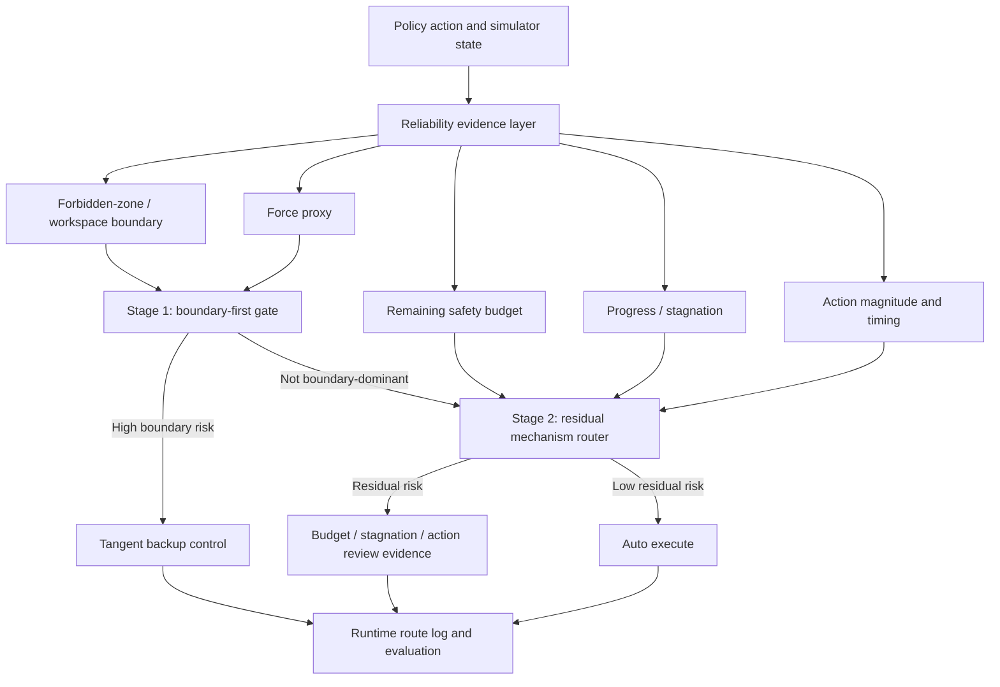
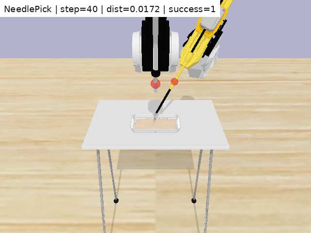
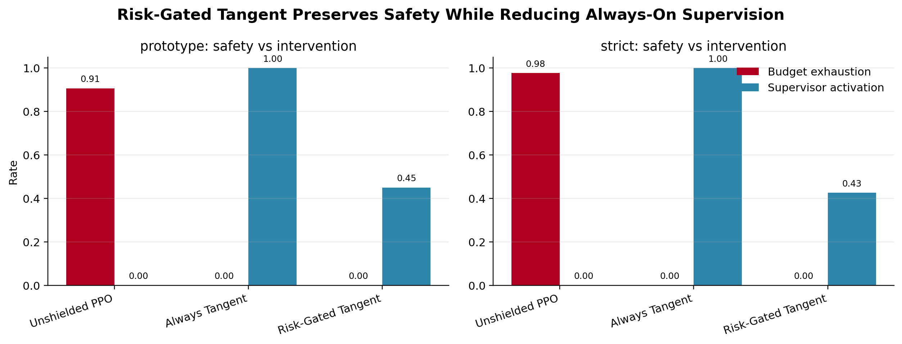
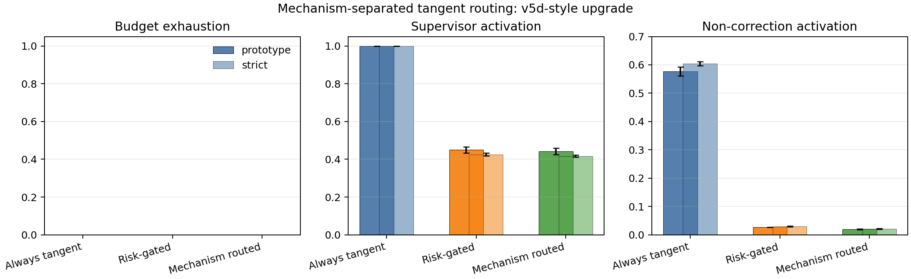
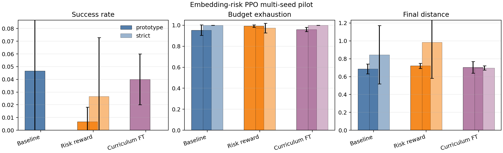

# Failure-Aware Surgical RL Under Runtime Uncertainty

Research code and public evidence for studying whether simulated surgical
robot policies can recognize unreliable execution and route intervention
before unsafe recovery or safety-budget failure becomes irreversible.

The central question is not only whether a rollout can be recovered. The main
question is whether the robot can identify **when** execution is becoming
unreliable, **what mechanism** caused the risk, and whether it should continue,
recover automatically, request review, or stop.

> Research prototype only. This repository is not a deployed surgical robot
> safety system and does not claim clinical, hardware, or real-robot validation.

## Project In One Sentence

This project starts from a simple constrained surgical-tool RL proxy, migrates
the reliability-supervision idea into SurRoL/PyBullet surgical simulation, then
upgrades the runtime supervisor from always-on backup control into risk-gated
and mechanism-separated reliability routing with explicit recovery/review
decisions.

The final GitHub framing is:

- **Risk-gated tangent** is the core controller-level safety result.
- **Mechanism-routed tangent** is the ECG-inspired reliability-routing upgrade.
- **SurRoL recovery routing** is the surgical-simulation migration evidence.
- **Embedding-risk PPO** is a preliminary training-loop experiment, not the
  main success claim.
- **Learning-to-routing flow** explains why the project first tries to improve
  the policy and then moves to runtime supervision when retraining is not
  robust enough.
- The strongest claim is internal simulation evidence for runtime reliability
  supervision, not real surgical autonomy.

## How The Research Logic Evolved

The project is best read as a staged research story.

1. Define the proxy problem: a surgical tool must reach a target while avoiding
   forbidden regions, force/contact proxies, workspace limits, and safety-budget
   exhaustion.
2. Discover the controller problem: always-on tangent backup can preserve
   safety, but it intervenes at every timestep.
3. Convert post-hoc risk analysis into runtime action supervision:
   risk-gated tangent activates backup only when interpretable risk evidence is
   high.
4. Upgrade the gate into mechanism-separated routing: Stage 1 handles
   boundary/force/workspace risk; Stage 2 records residual risks such as low
   budget, stagnation, and abnormal actions.
5. Move beyond the toy proxy: render SurRoL/PyBullet rollouts for
   `NeedleReach`, `NeedlePick`, and `GauzeRetrieve`.
6. Formalize failure routes: `auto_execute`, `auto_recovery`, `human_review`,
   and `abort_candidate`.
7. Run multi-seed recovery tests for action drift, perception drift, and
   jaw-stuck failures.
8. Train and audit learned/observable route supervisors.
9. Test whether embedding/KNN instability signals can feed back into PPO
   training through reward shaping and hard-negative curriculum.
10. Treat the limited training gains as evidence that a stronger runtime
    supervisor is still needed.

The resulting chain is:

```text
surgical rollout
  -> runtime safety / progress / visual / contact / embedding evidence
  -> reliability supervisor
  -> execute / recover / review / abort-candidate route
  -> controller correction, re-estimation, or logged limitation
```

## Key Finding

The strongest controller-level result is that the proxy supervisor can preserve
the 0.000 budget-exhaustion behavior of always-on tangent backup while reducing
unnecessary activation.

| Preset | Method | Budget exhaustion | Supervisor activation |
| --- | --- | ---: | ---: |
| prototype | always tangent | 0.000 | 1.000 |
| prototype | risk-gated tangent | 0.000 | 0.450 |
| prototype | mechanism-routed tangent | 0.000 | 0.443 |
| strict | always tangent | 0.000 | 1.000 |
| strict | risk-gated tangent | 0.000 | 0.426 |
| strict | mechanism-routed tangent | 0.000 | 0.416 |

The final controller policy is not a single black-box uncertainty score. It is
a mechanism-routed supervisor:



This is why the final contribution is best described as:

> Mechanism-separated runtime reliability supervision for failure-aware
> surgical RL in simulation.

## Learning-To-Routing Logic

The RL part is trained from simulator interaction, not from manual timestep
labels. PPO observes state or visual features, outputs an action, receives
reward and diagnostic information, and updates the policy.

Labels enter later as reliability supervision:

- timestep risk labels are weakly built from rollout logs, using boundary
  distance, force proxy, remaining budget, progress stagnation, explicit risk
  events, and episode failure;
- SurRoL route labels are distilled from the injected failure family and
  intended runtime response: `auto_execute`, `auto_recovery`, `human_review`,
  or `abort_candidate`;
- visual reliability labels use clean/corrupt visual-feature pairs and
  policy-vs-oracle action gaps.

The project then follows an ECG-style loop:

```text
train a baseline policy
  -> collect failures and weak reliability labels
  -> analyze embedding/PCA/KNN risk neighborhoods
  -> feed risk back into PPO through reward shaping and hard-negative curriculum
  -> observe limited multi-seed success/safety improvement
  -> use risk-gated and mechanism-routed supervision at runtime
```

For the detailed version, see
[docs/LEARNING_TO_ROUTING_FLOW.md](docs/LEARNING_TO_ROUTING_FLOW.md).

## Method And Evidence Chain

| Stage | What was done | Why it mattered | Main conclusion |
| --- | --- | --- | --- |
| 1. Custom proxy | Built a 3D constrained tool-navigation environment with forbidden region, force proxy, safety budget, and PPO/controller hooks. | Fast method development before running heavier SurRoL experiments. | The proxy is useful for testing safety-control mechanisms, but is not realistic surgery. |
| 2. Tangent backup | Added a controller that steers tangentially around forbidden regions. | Safer than stopping or moving directly into unsafe regions. | Always tangent reaches 0.000 budget exhaustion, but over-intervenes. |
| 3. Risk-gated tangent | Added interpretable risk gating before tangent backup. | Reliability analysis becomes a runtime action decision. | Safety is preserved while activation drops to 0.450/0.426. |
| 4. Mechanism-routed tangent | Added ECG-style boundary-first plus residual-mechanism routing. | Avoids compressing all risk into one score. | Activation drops slightly further to 0.443/0.416 and route explanations become mechanism-specific. |
| 5. SurRoL migration | Generated NeedleReach, NeedlePick, and GauzeRetrieve rendered rollouts and traces. | Shows the idea beyond the custom proxy. | The project has actual SurRoL/PyBullet visual evidence, not only proxy figures. |
| 6. Fault taxonomy | Organized failures into execution drift, perception drift, grasp/contact uncertainty, visual-state error, and unsafe recovery risk. | Makes failures comparable and routeable. | The project is a reliability-routing system, not a set of isolated demos. |
| 7. Multi-seed recovery | Ran 10-seed recovery suites on core SurRoL tasks. | Checks whether route-specific recovery is repeatable. | Key injected faults recover from 0/10 perturbed success to 9/10 or 10/10 recovered success. |
| 8. Learned route classifier | Trained a safety-biased route classifier. | Tests whether route decisions can be learned from evidence. | Held-out accuracy is 0.846 with 0.000 missed review-or-abort rate in the current split. |
| 9. Observable supervisor | Replaced privileged jaw-stuck trigger evidence with observable command/progress signals. | Reduces dependence on internal simulator state. | Jaw-stuck perturbations are detected in 10/10 episodes for both core tasks. |
| 10. Embedding-risk PPO | Fed embedding/KNN risk into reward shaping and hard-negative curriculum. | Tests whether explanation signals can improve training. | It changes learned behavior and improves some return/distance metrics, but not robust success/safety outcomes. |
| 11. Runtime routing conclusion | Interpreted the limited PPO improvement as evidence for a supervisor around the policy. | Surgical autonomy needs execution-time reliability, not only better offline learning. | The final contribution is a policy-plus-supervisor system. |

For the full stage-ordered report, see
[docs/RESEARCH_REPORT.md](docs/RESEARCH_REPORT.md).

For the compact experiment-and-evidence narrative, see
[docs/EXPERIMENT_EVIDENCE_SUMMARY.md](docs/EXPERIMENT_EVIDENCE_SUMMARY.md).

For the method diagram and reliability signal families, see
[docs/METHOD_OVERVIEW.md](docs/METHOD_OVERVIEW.md).

For the full learning-to-routing explanation, see
[docs/LEARNING_TO_ROUTING_FLOW.md](docs/LEARNING_TO_ROUTING_FLOW.md).

For the public figure and media index, see
[docs/FIGURE_ATLAS.md](docs/FIGURE_ATLAS.md).

For the documentation map, see [docs/README.md](docs/README.md).

## SurRoL Recovery Snapshot

Selected 10-seed paired recovery evidence:

| Task | Fault | Route / Intervention | Perturbed | Recovered |
| --- | --- | --- | ---: | ---: |
| NeedlePick | `action_noise` | internal phase-aware recovery | 0/10 | 9/10 |
| NeedlePick | `action_dropout` | internal phase-aware recovery | 0/10 | 10/10 |
| NeedlePick | `execution_slip` | internal phase-aware recovery | 0/10 | 10/10 |
| GauzeRetrieve | `action_noise` | internal phase-aware recovery | 0/10 | 10/10 |
| GauzeRetrieve | `action_dropout` | internal phase-aware recovery | 0/10 | 10/10 |
| GauzeRetrieve | `execution_slip` | internal phase-aware recovery | 0/10 | 10/10 |
| NeedlePick | `perception_bias` | review / re-estimation | 0/10 | 10/10 |
| GauzeRetrieve | `depth_scale_error` | review / re-estimation | 0/10 | 10/10 |
| NeedlePick | `jaw_stuck_open` | observable proxy recovery | 0/10 | 10/10 |
| GauzeRetrieve | `jaw_stuck_open` | observable proxy recovery | 0/10 | 10/10 |

These results support route-specific recovery in simulation. They do not prove
real-robot recovery or end-to-end learned autonomy.

## Visual Evidence

| Evidence family | Example |
| --- | --- |
| SurRoL rendered rollout |  |
| Risk-gated tangent result |  |
| Mechanism-routed tangent result |  |
| Embedding-risk training pilot |  |

## What Was Learned

The project did not simply show that recovery can work in selected cases. It
showed several reliability lessons:

- A safety controller can be effective but overactive.
- Runtime risk gating can preserve safety while reducing intervention burden.
- A single risk score is less interpretable than mechanism-separated routing.
- SurRoL failures need different routes: automatic recovery, review,
  re-estimation, or abort-candidate.
- Learned routing is possible, but current labels are still distilled from the
  project's own routing logic.
- Observable supervisor signals can reduce privileged-state dependence, but
  recovery primitives are not fully learned yet.
- Embedding/KNN instability can influence training, but current PPO pilots do
  not prove robust success-rate improvement.

## What Not To Overclaim

- This is not clinical validation.
- This is not real-robot deployment.
- This is not a complete end-to-end learned surgical autonomy system.
- The route labels are not independent expert annotations.
- The current observable supervisor still uses scripted recovery execution.
- The embedding-risk training result is preliminary and should not be described
  as a stable policy-improvement result.

## Repository Map

```text
src/                         custom constrained surgical RL environments
scripts/                     experiment, analysis, plotting, and report scripts
tests/                       unit and regression tests
docs/                        GitHub-facing reports, method overview, figure atlas
reports/                     detailed reports, figures, media, and tables
reports/media/               rendered SurRoL rollout evidence
reports/tables/              CSV summaries for SurRoL reliability experiments
outputs/                     selected lightweight aggregate summaries
runs/                        local checkpoints and training outputs, not committed
```

## Reproducibility Entry Points

```powershell
# Lightweight proxy tests
python -m pytest tests\test_tool_navigation.py

# Risk-gated and mechanism-routed tangent comparison
python scripts\evaluate_risk_gated_tangent.py --policy ppo --model runs\pilot_3d_50k_prototype_conditioned_seed0\model.zip --episodes 100 --seeds 0,1,2 --presets prototype,strict --threshold 0.5 --deterministic --risk-model-mode default_rule --out-dir outputs\mechanism_routed_tangent_v5d

# SurRoL summary rebuilds
python scripts\build_surrol_master_results.py
python scripts\build_surrol_fault_taxonomy.py
python scripts\train_surrol_route_classifier.py
python scripts\analyze_observable_proxy_risk.py
python scripts\build_surrol_observable_supervisor_step4.py

# Embedding-risk PPO pilot
python scripts\run_embedding_risk_multiseed_curriculum.py --seeds 0,1,2 --timesteps 8192 --episodes 50 --penalty-scale 0.25 --risk-threshold 0.55 --curriculum-probability 0.35 --curriculum-candidates 8
```
