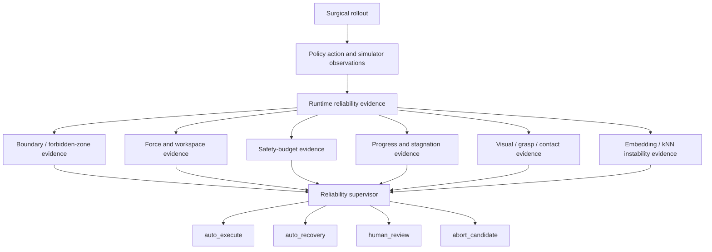

# Method Overview

This project is organized around a reliability question:

> When should a simulated surgical robot policy avoid automatic execution and
> route the episode into recovery, review, or abort-candidate handling?

## Pipeline



## Reliability Evidence Families

| Signal family | Examples | Reliability question |
| --- | --- | --- |
| Boundary safety | forbidden-zone distance, proposed clearance, workspace boundary | Is the next action close to irreversible geometry risk? |
| Force/contact proxy | force proxy, unsafe-zone contact | Is the tool entering a high-contact or unsafe region? |
| Safety budget | remaining budget, cumulative cost | Is the episode running out of safe execution capacity? |
| Progress | distance-to-goal trend, stagnation, late progress | Is the task still advancing? |
| Visual/perception state | perception bias, depth scale error, review/re-estimation triggers | Is the visual state reliable enough for autonomous execution? |
| Grasp/contact state | jaw-stuck command count, jaw progress, object progress | Is the manipulation state physically plausible? |
| Embedding instability | PCA/kNN risk, hard-negative curriculum risk | Does the state resemble known failure or high-risk regions? |

## Controller-Level Policy

Risk-gated tangent:

```text
policy action
  -> risk score
  -> if high risk: tangent backup
  -> else: execute policy action
```

Mechanism-routed tangent:

```text
policy action
  -> Stage 1 boundary evidence
      -> if high boundary risk: tangent backup
  -> Stage 2 residual evidence
      -> if residual risk: log review mechanism
  -> otherwise: execute policy action
```

## SurRoL Route Policy

| Route | Intended behavior | Example trigger |
| --- | --- | --- |
| `auto_execute` | Continue normal execution. | no strong risk signal |
| `auto_recovery` | Apply automatic recovery. | reversible action drift |
| `human_review` | Review or re-estimate. | perception bias, depth error, contact uncertainty |
| `abort_candidate` | Stop or flag recovery as unsafe. | near-target forbidden-zone risk |

## What The Method Is Not

- It is not a proof of formal safety.
- It is not a real-robot deployment.
- It is not a clinical validation system.
- It is not only a recovery script; the main method is reliability evidence
  plus route decision.
