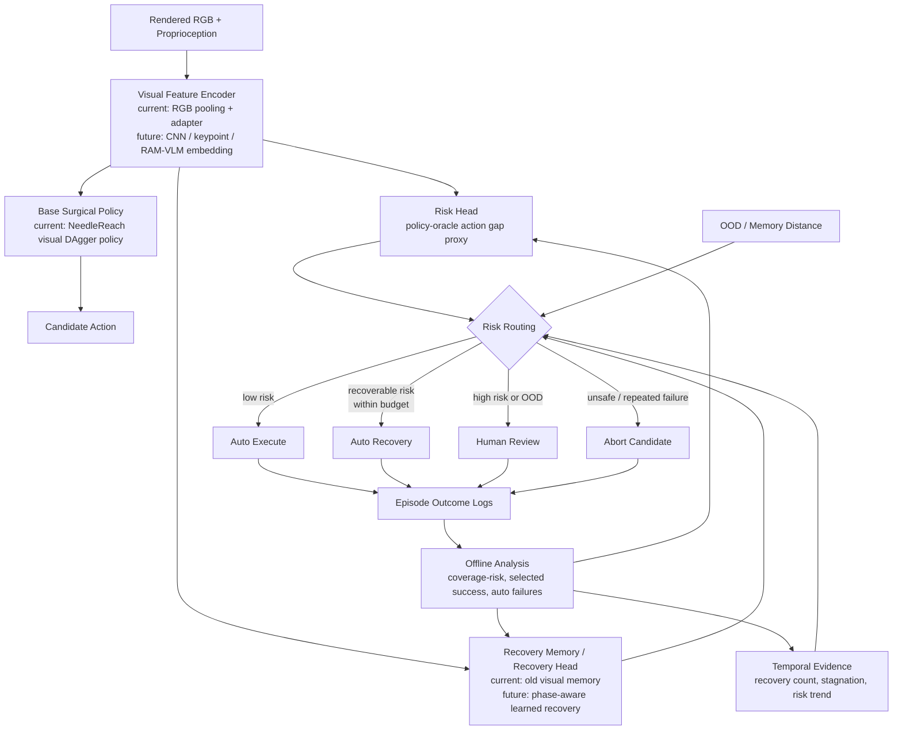

# System Diagram: Failure-Aware Surgical Reliability Supervisor

## Current Implemented Modules

| Module | Current status |
|---|---|
| Visual observation | Implemented as 208D `render_proprio_vision` |
| Visual adapter | Strict split offline denoising, candidate preprocessor |
| Base policy | NeedleReach visual DAgger policy |
| Risk head | Implemented, action-gap proxy |
| Recovery memory | Old augmented memory remains primary |
| OOD gate | Implemented via memory distance |
| Recovery budget | Budget 10 selected as current conservative guard |
| Temporal stagnation | Implemented as candidate secondary guard |
| Cross-task learned visual transfer | Blocked; task-specific data needed |

## Interpretation

The project should be presented as an external reliability supervisor rather than a replacement controller. Its central value is deciding whether autonomy should continue, recover, defer, or stop.

