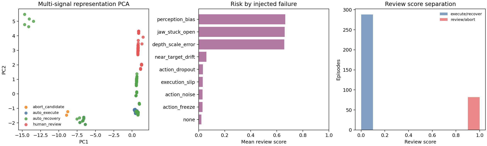

# ECG-Style RL Reliability Suite

## Purpose

This suite transfers the ECG project's broad reliability logic into the surgical RL project.
It is not only an embedding analysis. It covers representation geometry, decision uncertainty, trajectory structure, perturbation/failure robustness, model-side intervention, and mechanism routing.

## 1. Representation / Embedding Structure

| Metric | Value |
|---|---:|
| silhouette | 0.412 |
| Davies-Bouldin | 1.368 |
| mean KNN label entropy | 0.034 |
| mean local purity | 0.969 |
| KNN route conflict rate | 0.019 |

Closest route-centroid pairs:

| Route A | Route B | Distance | Normalized distance |
|---|---|---:|---:|
| auto_execute | auto_recovery | 2.777 | 1.114 |
| auto_recovery | human_review | 4.439 | 1.245 |
| auto_execute | human_review | 4.516 | 1.930 |
| abort_candidate | auto_recovery | 17.556 | 7.269 |
| abort_candidate | human_review | 18.374 | 8.120 |
| abort_candidate | auto_execute | 17.734 | 14.902 |

## 2. Decision Boundary / Confidence

| Score | Route-error AUROC | Review/abort AUROC | Review/abort AUPRC |
|---|---:|---:|---:|
| msp | 0.993 | 0.079 | 0.125 |
| entropy | 0.993 | 0.089 | 0.126 |
| margin_inverse | 0.993 | 0.065 | 0.125 |
| review_score | 0.118 | 1.000 | 1.000 |

## 3. Trajectory / Signal Structure And Robustness

Highest-risk injected failures by mean review score:

| Failure | Episodes | Mean review score | Review/abort rate | Mean final distance |
|---|---:|---:|---:|---:|
| perception_bias | 30 | 0.664 | 0.667 | 0.169 |
| jaw_stuck_open | 60 | 0.660 | 0.667 | 0.092 |
| depth_scale_error | 30 | 0.657 | 0.667 | 0.169 |
| near_target_drift | 45 | 0.059 | 0.044 | 0.043 |
| action_dropout | 30 | 0.032 | 0.000 | 0.086 |
| execution_slip | 30 | 0.032 | 0.000 | 0.092 |
| action_noise | 30 | 0.030 | 0.000 | 0.093 |
| action_freeze | 15 | 0.030 | 0.000 | 0.149 |
| none | 100 | 0.022 | 0.000 | 0.017 |

## 4. Model Upgrade / Intervention

The model-side upgrade is the multi-signal reliability head and four-way mechanism router generated by `scripts/run_multisignal_reliability_upgrade.py`.

| Router metric | Value |
|---|---:|
| accuracy | 0.973 |
| macro-F1 | 0.981 |
| missed review-or-abort rate | 0.000 |
| false review-or-abort rate | 0.000 |

## 5. Interpretation

This suite follows the ECG logic: broad analysis first, model intervention second, mechanism routing third.
For the current RL project, the evidence suggests that multiple runtime signals are more useful than a single embedding-only score.
The policy-improvement side remains limited, so the mature claim should emphasize reliability supervision and route-specific recovery.

## Limitations

- The analysis uses simulator and injected-failure labels, not surgeon annotations.
- Route features include some episode-level summaries, so this is a research supervisor audit before a fully online controller.
- The held-out split is internal and small for some rare routes such as `abort_candidate`.
- The suite does not claim clinical validation, hardware validation, or solved surgical autonomy.