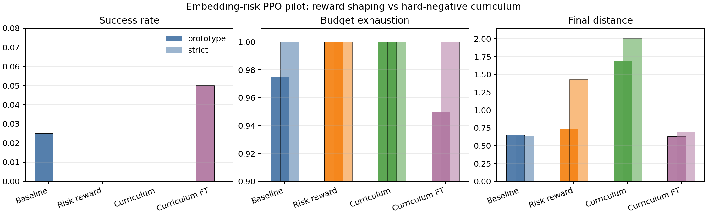

# Embedding-Risk Guided PPO Pilot

## Question

Can embedding/KNN instability analysis improve the PPO policy when the risk
signal is fed back into training, instead of being used only for post-hoc
explanation?

## Method

This experiment uses the custom constrained navigation proxy, not SurRoL. The
risk scorer is built from `outputs/risk_dataset/risk_dataset.csv`, filtered to
`source_kind=synthetic_navigation`. It standardizes seven timestep features,
projects them into a PCA embedding, and compares each state to nearest risk and
non-risk neighbors.

Two training-loop uses were implemented:

| Training use | Variant | Meaning |
|---|---|---|
| reward shaping | `conditioned_embedding_risk_penalty` | subtract a penalty when the embedding/KNN risk score is above threshold |
| hard-negative curriculum | `conditioned_embedding_risk_curriculum` | use the risk scorer during reset to select harder near-forbidden/path-blocking starts, then train with the risk penalty |

The curriculum version was tested both from scratch and as a two-stage
fine-tune: first train a baseline PPO policy, then continue training with
embedding-risk hard negatives.

## Latest Pilot

Run settings:

- 8,192 PPO timesteps per training stage.
- One seed.
- 40 deterministic evaluation episodes per preset.
- Training preset: `prototype`.
- Evaluation presets: `prototype` and `strict`.
- Risk threshold: 0.55.
- Penalty scale: 0.25.
- Curriculum reset probability: 0.35.

| Method | Preset | Success | Budget Exhaustion | Mean Return | Mean Cost | Final Distance | Mean Risk |
|---|---|---:|---:|---:|---:|---:|---:|
| baseline PPO | prototype | 0.025 | 0.975 | -41.783 | 2.011 | 0.650 | 0.303 |
| embedding-risk reward PPO | prototype | 0.000 | 1.000 | -48.153 | 2.062 | 0.737 | 0.318 |
| embedding-risk curriculum PPO | prototype | 0.000 | 1.000 | -31.593 | 2.000 | 1.692 | 0.536 |
| embedding-risk curriculum fine-tune PPO | prototype | 0.050 | 0.950 | -27.116 | 1.966 | 0.630 | 0.430 |
| baseline PPO | strict | 0.000 | 1.000 | -57.689 | 1.000 | 0.640 | 0.369 |
| embedding-risk reward PPO | strict | 0.000 | 1.000 | -82.266 | 1.000 | 1.433 | 0.444 |
| embedding-risk curriculum PPO | strict | 0.000 | 1.000 | -26.058 | 1.000 | 2.008 | 0.514 |
| embedding-risk curriculum fine-tune PPO | strict | 0.000 | 1.000 | -28.305 | 1.109 | 0.696 | 0.472 |

Full latest summary:
`outputs/embedding_risk_curriculum_finetune_pilot_summary.csv`.

## Interpretation

The result is useful but deliberately modest.

What is shown:

- The embedding/KNN instability signal now affects training in two ways:
  reward shaping and hard-negative reset sampling.
- The two-stage curriculum fine-tune improves the prototype pilot compared with
  baseline: success rises from 0.025 to 0.050, budget exhaustion falls from
  0.975 to 0.950, mean return improves from -41.783 to -27.116, and final
  distance improves from 0.650 to 0.630.
- Training from scratch on hard negatives is too aggressive in this short run:
  it improves return but worsens final distance, suggesting the policy becomes
  overly avoidance-oriented before learning reliable goal reaching.

What is not yet shown:

- The strict preset does not show a stable safety improvement. The fine-tuned
  model improves strict return but not strict budget exhaustion or final
  distance.
- This is one-seed, short-horizon PPO evidence. It should be reported as a
  pilot training-loop upgrade, not as a formal claim that embedding risk
  reliably improves the final policy.
- Mean embedding risk does not monotonically decrease, because the curriculum
  intentionally exposes the policy to more high-risk states during training.

## Earlier Reward-Shaping Pilot

Before the curriculum upgrade, three reward-only settings were tested with
8,192 PPO steps and 40 evaluation episodes:

| Pilot | Training signal |
|---|---|
| `continuous_t075` | continuous embedding-risk penalty, scale 0.75 |
| `continuous_t025` | continuous embedding-risk penalty, scale 0.25 |
| `thresholded_t075_thr055` | only penalize risk above 0.55, scale 0.75 |

The best reward-only settings produced isolated improvements: one improved
prototype success from 0.025 to 0.075 and budget exhaustion from 0.975 to
0.925, while another improved strict budget exhaustion from 1.000 to 0.925.
However, no reward-only setting won consistently across prototype and strict.

Full earlier comparison:
`outputs/embedding_risk_training_pilot_comparison.csv`.

## Conclusion

Embedding/KNN analysis is no longer only a classifier or explanation tool in
this repository. It is now connected to the PPO training loop as:

1. a risk-aware reward penalty;
2. a hard-negative curriculum reset mechanism;
3. a two-stage fine-tuning route that can partially improve prototype
   performance in a short pilot.

The strongest honest claim is: embedding risk can be used as a runtime training
signal and can produce partial policy improvement, but the current evidence is
not yet enough to claim robust multi-setting model improvement.
