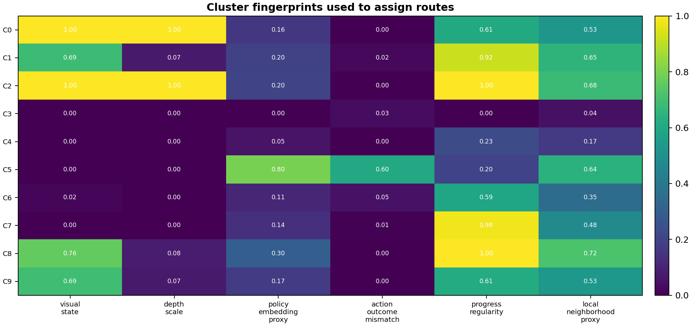

# Failure-Aware VPPV Behavior-Derived Routing Assignment

## Purpose

This experiment addresses the main limitation of a hand-written mechanism
router. The earlier VPPV router used simulator fault families and weak labels
to define routes. Here the route assignment is derived from rollout behavior
first: distance, progress, action deviation, perception error,
policy-proxy evidence, action-outcome mismatch, and local neighborhood
instability are embedded, clustered, and converted into routes by cluster
fingerprints.

The mechanism labels are not used to form the clusters. They are used only at
the end to evaluate whether the discovered behavior regions align with the
weak mechanism routes.

This is not a full model-internal analysis of the teacher's original VPPV
policy. The original checkpoint, training set, hidden activations, and model
confidence outputs are not available in this repository. The closest available
substitute is a behavior-representation analysis over simulator rollouts.

## Method

```text
SurRoL/VPPV step traces
  -> behavior and evidence feature vector
  -> train-seed standardization
  -> PCA behavior representation
  -> k-means clusters on train seeds
  -> cluster fingerprints from evidence means
  -> route assignment from cluster fingerprint priority
  -> held-out seed evaluation against weak route labels
```

The assignment rule is cluster-level, not step-label lookup:

1. Low-risk behavior clusters route to `continue`.
2. Depth-dominant clusters route to `depth_reestimate_or_cautious_approach`.
3. Visual-state clusters route to `reobserve_reestimate`.
4. Policy/action-outcome clusters route to `low_gain_correction_or_replan`.

## Summary

| split | step_rows | episodes | accuracy | macro_f1 | missed_high_risk_step_rate | false_alarm_on_nominal_step_rate | route_diversity |
| --- | --- | --- | --- | --- | --- | --- | --- |
| test | 3351 | 26 | 0.996 | 0.995 | 0.000 | 0.025 | 4 |
| train | 7472 | 59 | 0.981 | 0.984 | 0.002 | 0.063 | 4 |

Held-out test result: accuracy=0.996, macro-F1=0.995,
missed high-risk step rate=0.000, nominal false
alarm rate=0.025.

## Discovered Cluster Routes

| split | cluster | rows | model_derived_route | assignment_reason | visual_state_evidence | depth_scale_evidence | policy_embedding_proxy_evidence | action_outcome_mismatch_evidence | progress_regularity_evidence | local_neighborhood_proxy_evidence |
| --- | --- | --- | --- | --- | --- | --- | --- | --- | --- | --- |
| train_fingerprint | 0 | 331 | depth_reestimate_or_cautious_approach | depth fingerprint dominates | 1.000 | 1.000 | 0.164 | 0.001 | 0.607 | 0.528 |
| train_fingerprint | 1 | 1108 | reobserve_reestimate | visual-state fingerprint dominates | 0.687 | 0.071 | 0.198 | 0.020 | 0.919 | 0.651 |
| train_fingerprint | 2 | 2062 | depth_reestimate_or_cautious_approach | depth fingerprint dominates | 1.000 | 1.000 | 0.205 | 0.000 | 0.996 | 0.681 |
| train_fingerprint | 3 | 144 | continue | low model-state risk | 0.000 | 0.000 | 0.000 | 0.035 | 0.000 | 0.043 |
| train_fingerprint | 4 | 274 | continue | low model-state risk | 0.000 | 0.000 | 0.051 | 0.000 | 0.227 | 0.172 |
| train_fingerprint | 5 | 569 | low_gain_correction_or_replan | policy/action-outcome fingerprint dominates | 0.000 | 0.000 | 0.795 | 0.604 | 0.200 | 0.638 |
| train_fingerprint | 6 | 496 | continue | low model-state risk | 0.017 | 0.002 | 0.109 | 0.050 | 0.587 | 0.352 |
| train_fingerprint | 7 | 1079 | continue | below route threshold | 0.000 | 0.000 | 0.140 | 0.006 | 0.979 | 0.478 |
| train_fingerprint | 8 | 1080 | reobserve_reestimate | visual-state fingerprint dominates | 0.759 | 0.078 | 0.300 | 0.000 | 0.996 | 0.719 |
| train_fingerprint | 9 | 329 | reobserve_reestimate | visual-state fingerprint dominates | 0.695 | 0.071 | 0.173 | 0.000 | 0.615 | 0.535 |

## Transition-Point Check

| split | mechanism_label | episodes | alert_rate | median_lead_time |
| --- | --- | --- | --- | --- |
| test | depth_scale_error | 6 | 1.000 | 0.000 |
| test | nominal | 8 | 0.000 |  |
| test | policy_approach_drift | 6 | 1.000 | 4.000 |
| test | visual_estimation_bias | 6 | 1.000 | 0.000 |
| train | depth_scale_error | 14 | 1.000 | 0.000 |
| train | nominal | 17 | 0.000 |  |
| train | policy_approach_drift | 14 | 1.000 | 4.000 |
| train | visual_estimation_bias | 14 | 1.000 | 0.000 |

## Figures




## Interpretation

This is closer to the ECG logic than the earlier hand-designed route table:
the system first finds behavior regions in a rollout representation, then
assigns routes from the evidence fingerprint of each region. The result is
still not a real clinical dataset result, and it is not teacher-model
hidden-layer analysis. It is a simulator-rollout, weak-label validation of
behavior-derived routing.

The strongest use of this result is to say: the project now has an explicit
bridge from rollout behavior and representation analysis to route assignment.
It should not be described as a fully independent discovery of surgical
failure mechanisms from real-world data.

## Output Tables

- `reports/tables/failure_aware_vppv_model_derived_clusters.csv`
- `reports/tables/failure_aware_vppv_model_derived_step_routes.csv`
- `reports/tables/failure_aware_vppv_model_derived_summary.csv`
- `reports/tables/failure_aware_vppv_model_derived_confusion.csv`
- `reports/tables/failure_aware_vppv_model_derived_transition_points.csv`
