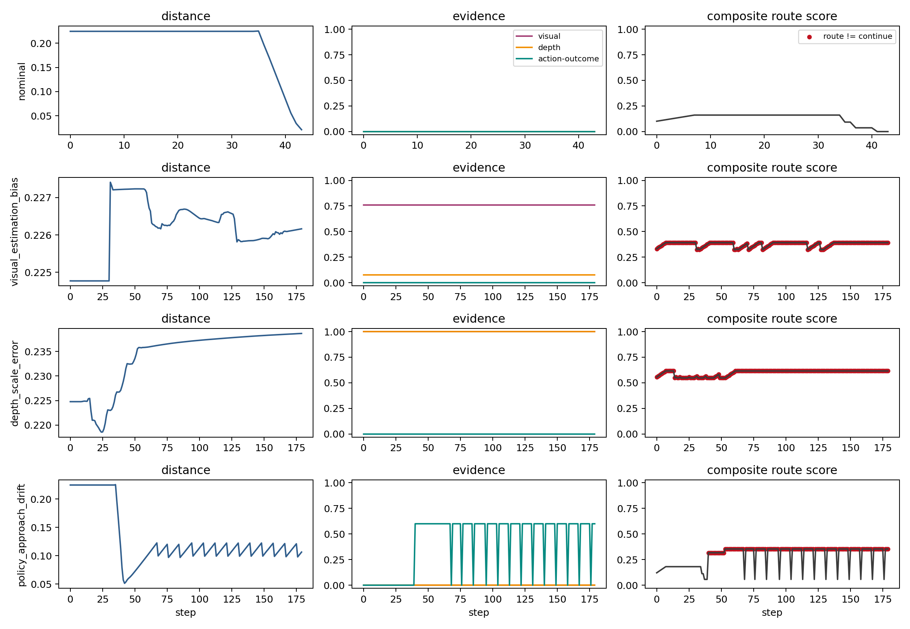

# Failure-Aware VPPV Step Evidence

This report completes the next evidence step after the composite episode
router. It builds a VPPV-style step-level dataset focused on the three
core mechanisms: visual state bias, depth-scale error, and high-level
approach-policy drift. Jaw mechanics and object-drop examples are not the
main target here.

## Step-Level Composite Router

- Step rows: 10823
- Step-route consistency with weak mechanism rules: 0.999
- Step-route macro-F1: 0.998
- Missed high-risk step rate: 0.000
- False alarm on nominal step rate: 0.005

This is a weak-label consistency result, not an independently labeled
surgeon-review benchmark. Its purpose is to check whether the evidence families
separate the intended VPPV mechanisms and drive different routes.

## Single-Evidence And Composite Comparison

| model | step_rows | accuracy | macro_f1 | missed_high_risk_step_rate | false_alarm_on_nominal_step_rate | route_diversity |
| --- | --- | --- | --- | --- | --- | --- |
| visual_only | 10823 | 0.561 | 0.367 | 0.155 | 0.000 | 2 |
| depth_only | 10823 | 0.561 | 0.381 | 0.578 | 0.000 | 2 |
| policy_only | 10823 | 0.357 | 0.355 | 0.845 | 0.005 | 2 |
| single_score | 10823 | 0.240 | 0.131 | 0.578 | 0.000 | 2 |
| composite_step_route | 10823 | 0.999 | 0.998 | 0.000 | 0.005 | 4 |

## Fixed-Budget Step Capture

Top evidence families at a 10% step-intervention budget:

| mechanism | evidence | budget | selected_steps | capture_rate | precision_at_budget |
| --- | --- | --- | --- | --- | --- |
| all | visual_state_evidence | 0.100 | 1083 | 0.132 | 1.000 |
| all | depth_scale_evidence | 0.100 | 1083 | 0.132 | 1.000 |
| all | policy_embedding_proxy_evidence | 0.100 | 1083 | 0.132 | 1.000 |
| all | action_outcome_mismatch_evidence | 0.100 | 1083 | 0.132 | 1.000 |
| all | local_neighborhood_proxy_evidence | 0.100 | 1083 | 0.132 | 1.000 |

## Early Warning

| mechanism | model | episodes | alert_rate | false_alert_rate | median_lead_time | median_lag_after_onset |
| --- | --- | --- | --- | --- | --- | --- |
| depth_scale_error | action_outcome_only | 20 | 0.050 | 0.000 | 111.000 | 68.000 |
| depth_scale_error | composite | 20 | 1.000 | 0.000 | 179.000 | 0.000 |
| depth_scale_error | depth_only | 20 | 1.000 | 0.000 | 179.000 | 0.000 |
| depth_scale_error | policy_only | 20 | 0.000 | 0.000 | nan | nan |
| depth_scale_error | visual_only | 20 | 1.000 | 0.000 | 179.000 | 0.000 |
| nominal | action_outcome_only | 25 | 0.000 | 0.000 | nan | nan |
| nominal | composite | 25 | 0.000 | 0.000 | nan | nan |
| nominal | depth_only | 25 | 0.000 | 0.000 | nan | nan |
| nominal | policy_only | 25 | 0.000 | 0.000 | nan | nan |
| nominal | visual_only | 25 | 0.000 | 0.000 | nan | nan |
| policy_approach_drift | action_outcome_only | 20 | 1.000 | 0.000 | 3.500 | 0.000 |
| policy_approach_drift | composite | 20 | 1.000 | 0.000 | 3.500 | 0.000 |
| policy_approach_drift | depth_only | 20 | 0.000 | 0.000 | nan | nan |
| policy_approach_drift | policy_only | 20 | 1.000 | 0.000 | 3.500 | 0.000 |
| policy_approach_drift | visual_only | 20 | 0.000 | 0.000 | nan | nan |
| visual_estimation_bias | action_outcome_only | 20 | 0.050 | 0.000 | 109.000 | 70.000 |
| visual_estimation_bias | composite | 20 | 1.000 | 0.000 | 179.000 | 0.000 |
| visual_estimation_bias | depth_only | 20 | 0.000 | 0.000 | nan | nan |
| visual_estimation_bias | policy_only | 20 | 0.000 | 0.000 | nan | nan |
| visual_estimation_bias | visual_only | 20 | 1.000 | 0.000 | 179.000 | 0.000 |

## Mechanism Evidence Figure

## Output Tables

- `reports/tables/failure_aware_vppv_step_dataset.csv`
- `reports/tables/failure_aware_vppv_step_route_summary.csv`
- `reports/tables/failure_aware_vppv_step_evidence_ablation.csv`
- `reports/tables/failure_aware_vppv_step_early_warning.csv`
- `reports/tables/failure_aware_vppv_step_early_warning_summary.csv`

## Claim Boundary

The dataset is built from SurRoL simulator traces and weak mechanism labels
from controlled perturbations. It supports a VPPV-style reliability
prototype, not real surgical deployment or surgeon-labeled validation.
