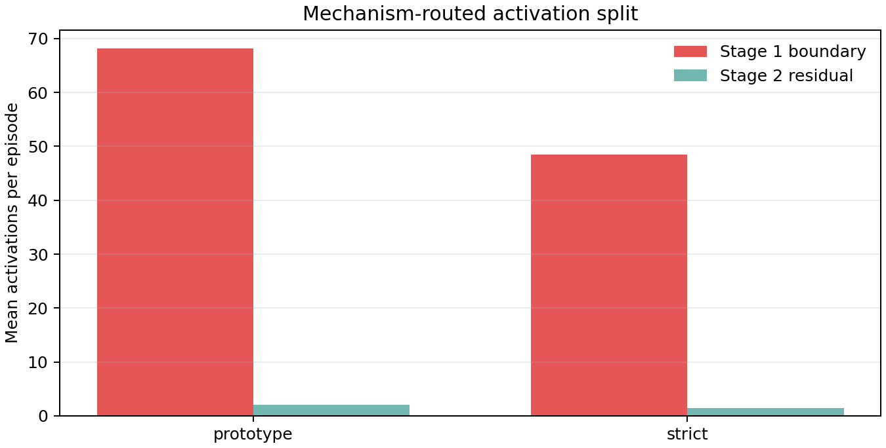

# Mechanism-Routed Tangent Backup: ECG-Inspired v5d Upgrade

## Question

Can the proxy surgical RL supervisor be upgraded from a single risk-gated
tangent controller into a mechanism-separated hierarchical reliability router,
similar in spirit to the VT/VF ECG v5d reliability-routing upgrade?

## ECG-Inspired Design Transfer

The VT/VF ECG compendium's final upgrade is not simply "use a larger model".
Its key idea is mechanism-separated hierarchical routing:

1. handle the most dangerous boundary mechanism first;
2. preserve decision capacity for residual mechanisms;
3. report evidence by mechanism family rather than collapsing everything into
   one total risk score;
4. keep claims as internal reliability evidence, not deployment validation.

The RL analogue is:

| ECG v5d idea | Surgical RL analogue |
|---|---|
| VT/VF boundary-first branch | forbidden-zone / workspace / force boundary branch |
| residual mechanism router | budget-low, stagnation, late-action, large-action residual branch |
| reserved residual budget | Stage 2 residual review capacity is tracked separately from Stage 1 safety backup |
| decision-support routing | route labels explain whether the system executed, backed up, or flagged residual review |

## Method

The new runtime wrapper is `MechanismRoutedTangentSafetyShieldAction`, exposed
as the environment variant `conditioned_mechanism_routed_tangent_shielded`.

It separates decisions into two stages:

1. **Stage 1 boundary tangent backup.** If current/proposed forbidden clearance,
   workspace boundary, or force proxy indicates imminent irreversible safety
   risk, the tangent backup controller is activated.
2. **Stage 2 residual review.** If Stage 1 is not active, low remaining budget,
   stalled progress, late failure to approach the goal, or large actions can
   produce a residual route. This is recorded as reliability evidence rather
   than automatically applying tangent correction.

This turns the earlier single risk score into a mechanism-level route:
`auto_execute`, `stage1_boundary_tangent_backup`, `stage2_budget_review`,
`stage2_stagnation_review`, or `stage2_action_review`.

## Online PPO Comparison

Evaluation settings:

- Policy: existing prototype PPO checkpoint.
- Presets: `prototype`, `strict`.
- Seeds: 0, 1, 2.
- Episodes: 100 per seed and preset.
- Threshold: 0.5.
- Comparator methods: always tangent, original risk-gated tangent, mechanism
  routed tangent.

| Method | Preset | Success | Budget Exhaustion | Supervisor Activation | Non-Correction Activation |
|---|---|---:|---:|---:|---:|
| always tangent | prototype | 0.107 | 0.000 | 1.000 | 0.577 |
| risk-gated tangent | prototype | 0.107 | 0.000 | 0.450 | 0.027 |
| mechanism-routed tangent | prototype | 0.107 | 0.000 | 0.443 | 0.020 |
| always tangent | strict | 0.017 | 0.000 | 1.000 | 0.604 |
| risk-gated tangent | strict | 0.017 | 0.000 | 0.426 | 0.030 |
| mechanism-routed tangent | strict | 0.017 | 0.000 | 0.416 | 0.021 |

Mechanism split for the new router:

| Preset | Stage 1 Boundary Activations | Stage 2 Residual Activations |
|---|---:|---:|
| prototype | 68.190 | 2.057 |
| strict | 48.417 | 1.507 |

Full tables:

- `outputs/mechanism_routed_tangent_v5d_aggregate_summary.csv`
- `outputs/mechanism_routed_tangent_v5d_route_summary.csv`

## Interpretation

What is shown:

- The mechanism-routed supervisor preserves the 0.000 budget exhaustion of
  always-tangent and original risk-gated tangent in both prototype and strict.
- It slightly reduces supervisor activation relative to the original
  risk-gated tangent: 0.450 to 0.443 in prototype and 0.426 to 0.416 in strict.
- It also reduces non-correction activations, meaning fewer timesteps where the
  supervisor is considered active but no tangent correction is actually needed:
  0.027 to 0.020 in prototype and 0.030 to 0.021 in strict.
- It gives each intervention an interpretable mechanism route instead of a
  single undifferentiated risk label.

What is not shown:

- The improvement over the previous risk-gated tangent controller is modest.
- This is still a custom proxy simulation result, not SurRoL or real-robot
  validation.
- Stage 2 residual routes are currently logged as review evidence; they do not
  yet trigger a separate learned recovery policy.

## Claim

The strongest safe claim is that the surgical RL project now has an ECG-inspired
mechanism-separated hierarchical reliability supervisor. It preserves the
previous risk-gated tangent safety result while making the routing logic more
interpretable and slightly reducing unnecessary supervisor activation.

The project should not claim that this solves surgical autonomy. It is internal
simulation evidence that reliability analysis can be organized into runtime
mechanism-specific decisions rather than a single black-box risk correction.
