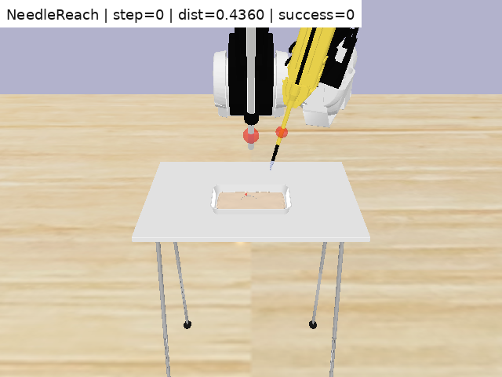
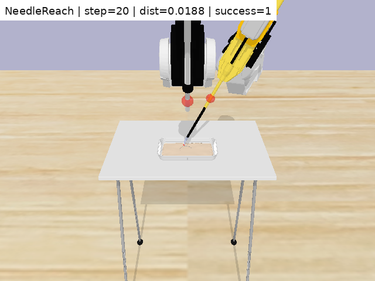
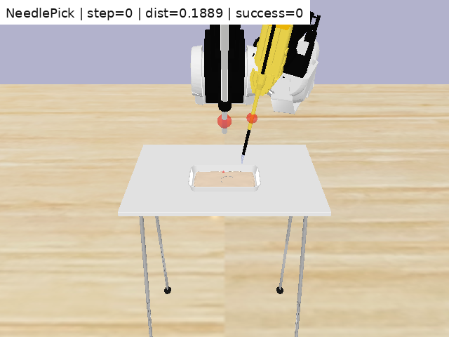
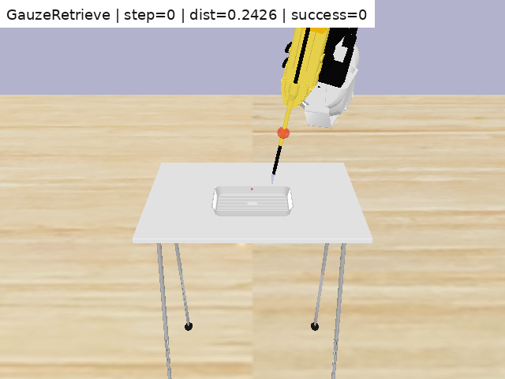

# SurRoL Render Evidence

These assets export raw SurRoL/PyBullet RGB rollouts for repository evidence.
They are baseline oracle-render sanity checks, not the main recovery-route
videos. Their purpose is to show that the project entered real SurRoL/PyBullet
tasks and could render task rollouts with logged traces.

| Task | Steps | Success | Final distance | GIF | MP4 | Trace |
|---|---:|---:|---:|---|---|---|
| NeedleReach | 20 | 1 | 0.0188 | `needlereach_oracle_rollout.gif` | `needlereach_oracle_rollout.mp4` | `rollout_trace.csv` |
| NeedlePick | 40 | 1 | 0.0172 | `needlepick_oracle_rollout.gif` | `needlepick_oracle_rollout.mp4` | `rollout_trace.csv` |
| GauzeRetrieve | 34 | 1 | 0.0106 | `gauzeretrieve_oracle_rollout.gif` | `gauzeretrieve_oracle_rollout.mp4` | `rollout_trace.csv` |

## What The Videos Show

| Task | What to look for | What it proves | What it does not prove |
|---|---|---|---|
| NeedleReach | The tool tip moves from the starting pose toward the target region; the overlay distance drops from about 0.436 to 0.0188 and success becomes 1. | SurRoL NeedleReach can be rendered and stepped with an oracle rollout. | It is not a failure-recovery demonstration. |
| NeedlePick | The tool approaches and contacts the needle region; the visible motion is subtle, so the overlay and trace are needed to interpret success. | SurRoL NeedlePick can be rendered and logged. | It does not by itself show learned grasping or the reliability router. |
| GauzeRetrieve | The tool approaches the gauze region; the final frame reaches a small final distance and success becomes 1. | SurRoL GauzeRetrieve can be rendered and logged. | It does not by itself show recovery routing or human-review logic. |

## Selected Rendered Frames

| Task | Initial frame | Later frame | Rollout media |
|---|---|---|---|
| NeedleReach |  |  | [GIF](needlereach/needlereach_oracle_rollout.gif), [MP4](needlereach/needlereach_oracle_rollout.mp4), [trace CSV](needlereach/rollout_trace.csv) |
| NeedlePick |  |  | [GIF](needlepick/needlepick_oracle_rollout.gif), [MP4](needlepick/needlepick_oracle_rollout.mp4), [trace CSV](needlepick/rollout_trace.csv) |
| GauzeRetrieve |  |  | [GIF](gauzeretrieve/gauzeretrieve_oracle_rollout.gif), [MP4](gauzeretrieve/gauzeretrieve_oracle_rollout.mp4), [trace CSV](gauzeretrieve/rollout_trace.csv) |

The main README links these media files as migration evidence from the custom
3D proxy to SurRoL.

These rollouts are included as visual simulation evidence only. They should be
read together with the route-specific recovery tables and controller-level
figures rather than as real surgical footage or clinical validation.
